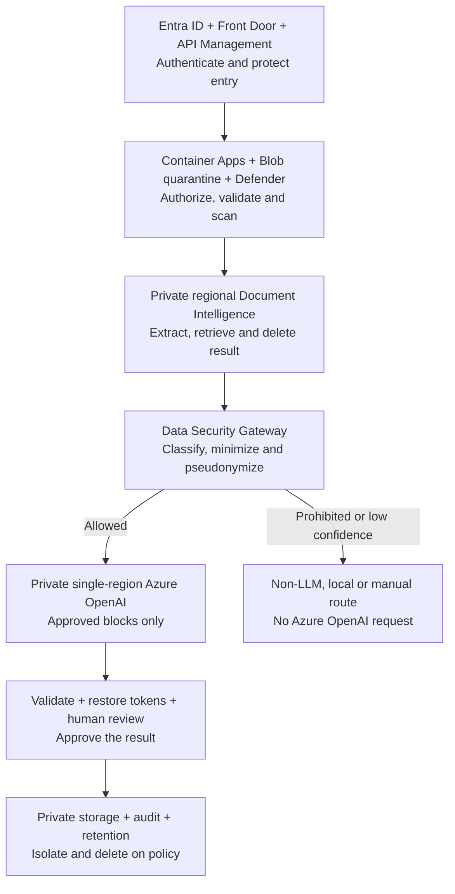

# CareTranslate Studio

A runnable proof of concept for youth-care teams to upload Arabic or Chinese PDFs/images, extract document structure with Azure Document Intelligence, translate non-English content with Azure OpenAI GPT-5-mini, and review page-wise English JSON in a studio-style interface.

The app opens in a complete three-page demo, so the UI can be evaluated before Azure credentials are added.

## What is included

- Python 3.12 FastAPI backend with async SQLAlchemy and SQLite
- Azure Document Intelligence prebuilt-layout extraction with language detection and bounding polygons
- Azure OpenAI GPT-5-mini translation through the Azure v1 API and Structured Outputs
- Deterministic block IDs, protected-token validation, retries, and review flags
- One JSON artifact per page plus extracted and bilingual document exports
- Next.js/TypeScript review studio with thumbnails, zoom, rotation, selectable overlays, and synchronized result cards
- Extracted, Translated, and page-wise JSON tabs
- PDF.js rendering for real documents and a no-credentials demo mode
- Alembic migration, local file storage, Docker API option, tests, and PowerShell setup/run scripts

## Project documentation

CareTranslate Studio is currently a functional proof of concept with an explicitly documented path to production. Use the status labels **Implemented**, **Partially implemented**, **Production target**, and **Open decision** to avoid confusing current behavior with planned capability.

- **[Product requirements](docs/PRD.md):** Users, scope, functional and non-functional
  requirements, success measures, decisions, roadmap, and production release gates.

- **[Data security and AI processing plan](docs/DATA-SECURITY.md):** Manager-facing security
  decision paper: readable production diagram, service-protection matrix, secure Azure OpenAI
  and no-LLM routes, risks, approvals, and evidence gates.

- **[Executive presentation](docs/presentations/CareTranslate-Studio-Executive-Overview.pptx):**
  Seven-slide management overview of the product, current POC, secure Azure processing flow,
  target architecture, processing profiles, production roadmap, and required decisions.

- **[Architecture](docs/ARCHITECTURE.md):** Current POC design, processing flow, schemas, APIs,
  known gaps, and target Azure production architecture.

- **[Engineering rules](docs/RULES.md):** Mandatory security, privacy, translation, versioning,
  testing, accessibility, and AI-assistant rules.

- **[Project memory](docs/MEMORY.md):** Concise current-state facts, approved decisions,
  commands, versions, quality baseline, and limitations.

- **[Contributor guide](AGENTS.md):** Required reading order, safe workflow, change contracts,
  quality gates, and definition of done.

Start with `AGENTS.md` when contributing. Product and architecture decisions belong in the documents above; temporary task notes and secrets do not.

## Architecture


```text
Upload → Validate and store → Azure Document Intelligence → Normalize page/block geometry → Detect language → Batch non-English blocks → Azure OpenAI GPT-5-mini → Validate IDs and protected tokens → Write page JSON/exports → Review in Studio
```

1. **Architecture view:** Current POC
   - **Data route:** Browser → Python API → Azure Document Intelligence → raw extracted
     non-English blocks → Azure OpenAI
   - **Exposed to generative LLM?:** **Yes; raw extracted blocks may be processed by the LLM**
   - **Security/status statement:** Synthetic or explicitly approved de-identified data only;
     not approved for real confidential/restricted records

2. **Architecture view:** Proposed production
   - **Data route:** Private intake → Document Intelligence → Data Security Gateway → approved
     route
   - **Exposed to generative LLM?:** Normally only minimum pseudonymized blocks;
     non-LLM/local/manual alternatives exist
   - **Security/status statement:** Production target selected by the profiles in
     [docs/DATA-SECURITY.md](docs/DATA-SECURITY.md)

3. **Architecture view:** Credential boundary
   - **Data route:** Azure credentials remain in the Python backend
   - **Exposed to generative LLM?:** Browser cannot call the provider directly
   - **Security/status statement:** Credentials must never be sent to browser code

### Proposed secure production path

1. **Diagram status:** Proposed secure production path
   - **Azure OpenAI position:** Retained for approved translation/future features; normally
     receives approved minimized/pseudonymized blocks only
   - **Implementation status:** Planned; not implemented in the current POC



1. **Protection point:** Access
   - **Main services:** Entra ID, Front Door Premium WAF, API Management
   - **Data handled:** Identity/request metadata; approved upload traffic
   - **Microsoft-managed processing?:** Yes
   - **Exposed to generative LLM?:** No
   - **Required protection/status:** Identity, WAF, token validation and rate protection —
     Production target

2. **Protection point:** Files
   - **Main services:** Blob quarantine, Defender for Storage
   - **Data handled:** Complete uploaded file
   - **Microsoft-managed processing?:** Yes
   - **Exposed to generative LLM?:** No
   - **Required protection/status:** Isolate uploads and block malware before extraction —
     Production target

3. **Protection point:** Extraction
   - **Main services:** Private regional Document Intelligence
   - **Data handled:** Complete document and extraction result temporarily
   - **Microsoft-managed processing?:** Yes
   - **Exposed to generative LLM?:** No; DI does not call Azure OpenAI automatically
   - **Required protection/status:** Private extraction and immediate provider-result deletion —
     Production target

4. **Protection point:** LLM boundary
   - **Main services:** Policy engine, PII detection, deterministic tokenization, Key Vault
   - **Data handled:** Raw extracted text inside controlled boundary
   - **Microsoft-managed processing?:** Azure hosts compute; company logic controls content
   - **Exposed to generative LLM?:** No; it controls what may be sent
   - **Required protection/status:** Keep raw/excess data out of the normal Azure OpenAI request
     — Production target

5. **Protection point:** Generative processing
   - **Main services:** Private single-region Azure OpenAI
   - **Data handled:** Normally minimum approved pseudonymized blocks
   - **Microsoft-managed processing?:** Yes
   - **Exposed to generative LLM?:** **Yes; submitted prompt blocks are processed by the LLM**
   - **Required protection/status:** Approved profile/deployment only; raw requires exception —
     Production target/open approval

6. **Protection point:** Output
   - **Main services:** Schema/leakage validators and human review
   - **Data handled:** Model output and authorized source context
   - **Microsoft-managed processing?:** Application-controlled
   - **Exposed to generative LLM?:** No additional exposure
   - **Required protection/status:** Check fidelity, completeness, tokens and leakage —
     Production target

7. **Protection point:** Evidence and deletion
   - **Main services:** Blob, PostgreSQL, Monitor/Sentinel, retention worker
   - **Data handled:** Approved artifacts and content-free metadata
   - **Microsoft-managed processing?:** Yes
   - **Exposed to generative LLM?:** No
   - **Required protection/status:** Tenant isolation, audit, detection, retention and deletion
     evidence — Production target

The manager-ready control matrix, processing profiles, risk register and approval checklist are in [docs/DATA-SECURITY.md](docs/DATA-SECURITY.md).

## Prerequisites

- Windows PowerShell 5.1 or PowerShell 7
- Python 3.12
- Node.js 22.13 or newer
- An Azure Document Intelligence resource
- An Azure OpenAI resource with a GPT-5-mini deployment

## Quick start

From the project root:


```text
PowerShell -ExecutionPolicy Bypass -File .\scripts\setup.ps1
```

Edit backend/.env and enter the Azure values described below. Then start both services:


```text
PowerShell -ExecutionPolicy Bypass -File .\scripts\run-poc.ps1
```

Open:

- Studio: http://localhost:3000
- API documentation: http://localhost:8000/docs
- API readiness: http://localhost:8000/api/v1/health/ready

If Azure values are still empty, the Studio demo remains fully usable and the readiness endpoint reports both Azure dependencies as unconfigured.

## Azure configuration

Copy backend/.env.example to backend/.env if the setup script has not already done so.

Required Azure Document Intelligence values:


```text
AZURE_DOCUMENT_INTELLIGENCE_ENDPOINT=https://YOUR-DOCUMENT-INTELLIGENCE-RESOURCE.cognitiveservices.azure.com/
AZURE_DOCUMENT_INTELLIGENCE_API_KEY=YOUR_KEY
AZURE_DOCUMENT_INTELLIGENCE_MODEL_ID=prebuilt-layout
```

Required Azure OpenAI values:


```text
AZURE_OPENAI_BASE_URL=https://YOUR-AZURE-OPENAI-RESOURCE.openai.azure.com/openai/v1/
AZURE_OPENAI_API_KEY=YOUR_KEY
AZURE_OPENAI_DEPLOYMENT=YOUR_GPT_5_MINI_DEPLOYMENT_NAME
AZURE_OPENAI_REASONING_EFFORT=minimal
```

Important: AZURE_OPENAI_DEPLOYMENT is the deployment name created in Azure, not necessarily the catalog model name.

The frontend needs these browser-safe values in frontend/.env.local:


```text
NEXT_PUBLIC_API_BASE_URL=http://localhost:8000/api/v1
NEXT_PUBLIC_API_AUTH_TOKEN=local-dev-token-change-me
```

Match `NEXT_PUBLIC_API_AUTH_TOKEN` to a token listed in backend `API_AUTH_TOKENS`.
This local bearer token is for localhost PRD-ready auth only — never put Azure
keys in any `NEXT_PUBLIC_*` variable. Production replaces this with Entra/JWT.

## Run services separately

Backend:


```text
PowerShell -ExecutionPolicy Bypass -File .\scripts\start-backend.ps1
```

Frontend:


```text
PowerShell -ExecutionPolicy Bypass -File .\scripts\start-frontend.ps1
```

## Docker API option

After creating backend/.env:


```text
docker compose up --build api
```

The frontend is still started with scripts/start-frontend.ps1. Runtime database and artifacts are written to data/ and storage/ on the host.

## Processing flow

1. Upload accepts PDF, PNG, JPEG, TIFF, or BMP and checks both extension and file signature.
2. The original file is stored under storage/documents/<document-id>/source.
3. Azure Document Intelligence prebuilt-layout returns pages, paragraphs, words, tables, languages, spans, and polygons.
4. The mapper creates deterministic block IDs and page-aware geometry.
5. English blocks are retained; Arabic, Simplified/Traditional Chinese, and mixed blocks are batched for translation.
6. GPT-5-mini returns a strict structured response keyed by the original block IDs.
7. Validation checks exact IDs/order, empty translations, and protected values such as dates, case codes, URLs, email addresses, and numbers.
8. The backend writes one canonical JSON file per page plus extracted and bilingual exports.
9. The Studio loads the source document, renders its overlays, and synchronizes selection with the result panel.

## Page-wise JSON

Each completed page is available at:


```text
GET /api/v1/documents/{document_id}/pages/{page_number}
```

Example shape:


```text
{
  "schema_version": "1.0",
  "document_id": "...",
  "document_status": "completed",
  "page": {
    "page_number": 1,
    "page_count": 3,
    "width": 8.5,
    "height": 11,
    "unit": "inch",
    "source_text": "...",
    "translated_text": "..."
  },
  "blocks": [
    {
      "block_id": "b000001",
      "reading_order": 1,
      "source_text": "...",
      "source_language": "ar",
      "translated_text": "...",
      "translation_status": "translated",
      "bounding_regions": [
        { "page_number": 1, "polygon": [{ "x": 1.0, "y": 1.2 }] }
      ],
      "ocr_confidence": 0.97,
      "review_required": false
    }
  ],
  "tables": [],
  "warnings": []
}
```

Downloads:

- GET /api/v1/documents/{id}/downloads/page?page=1
- GET /api/v1/documents/{id}/downloads/extracted
- GET /api/v1/documents/{id}/downloads/bilingual

## Main API routes

- POST /api/v1/documents — upload and queue a document
- GET /api/v1/documents/{id} — status and document metadata
- GET /api/v1/documents/{id}/source — inline original document
- GET /api/v1/documents/{id}/pages — page summaries
- GET /api/v1/documents/{id}/pages/{page} — canonical page JSON
- POST /api/v1/documents/{id}/retry — retry failed or reviewable work
- DELETE /api/v1/documents/{id} — delete a terminal document and its artifacts
- GET /api/v1/health/ready — service and Azure configuration readiness

## Verification

Backend:


```text
cd backend
.\.venv\Scripts\python.exe -m ruff check app tests
.\.venv\Scripts\python.exe -m pytest -q -p no:cacheprovider
```

Frontend:


```text
cd frontend
npm run lint
npm run build
```

## POC boundaries

This POC deliberately uses SQLite, local artifact storage, an in-process worker, Azure Document Intelligence, and an Azure OpenAI translation path that receives extracted source text. It has no production data-classification or policy gateway. **Do not use real personal, youth-care, clinical, legal, education, justice, or other sensitive records.**

Before a real-data pilot, implement and verify organization authentication, backend authorization, tenant isolation, quarantine/malware scanning, private managed storage and queues, managed identity, private endpoints, outbound egress controls, server-side processing profiles, immediate provider-result deletion, content-free telemetry, retention/deletion evidence, audit, incident response, and human review. The full management decision and evidence plan is in [docs/DATA-SECURITY.md](docs/DATA-SECURITY.md).
