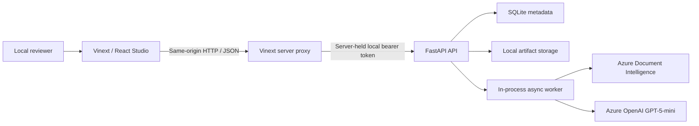
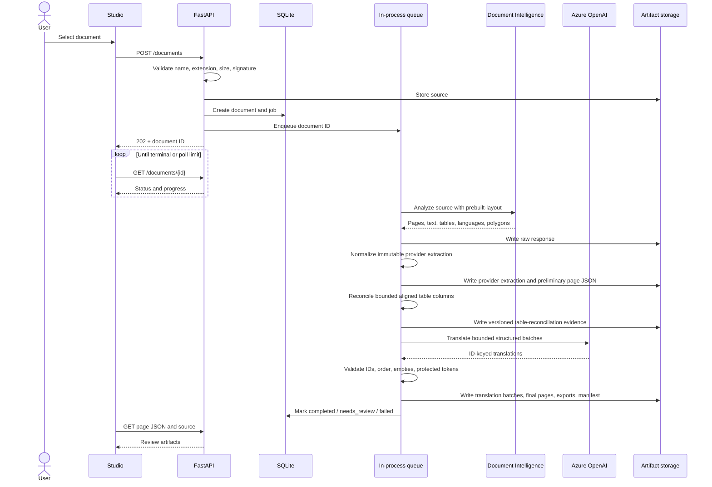
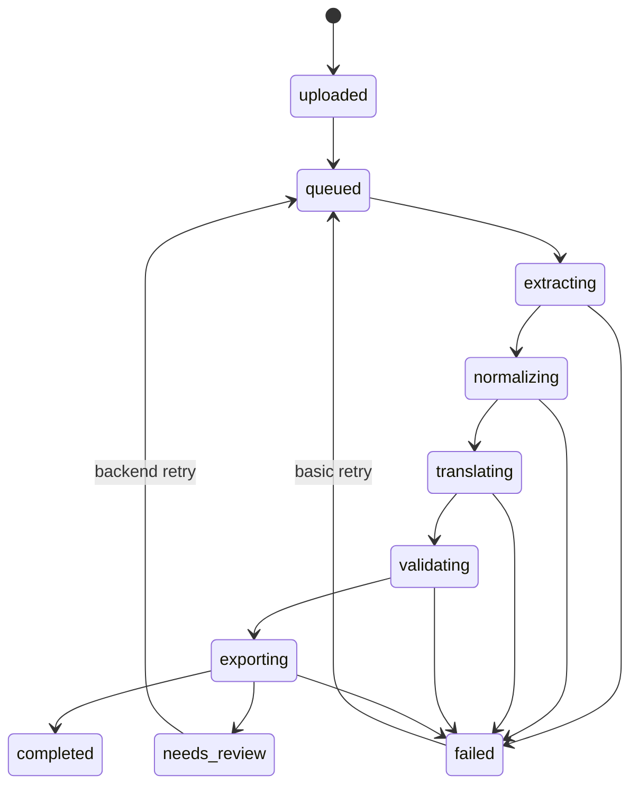
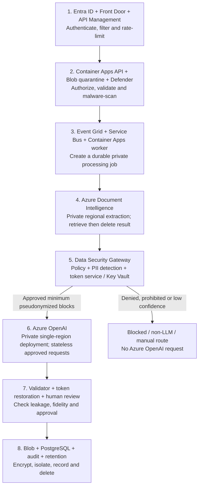
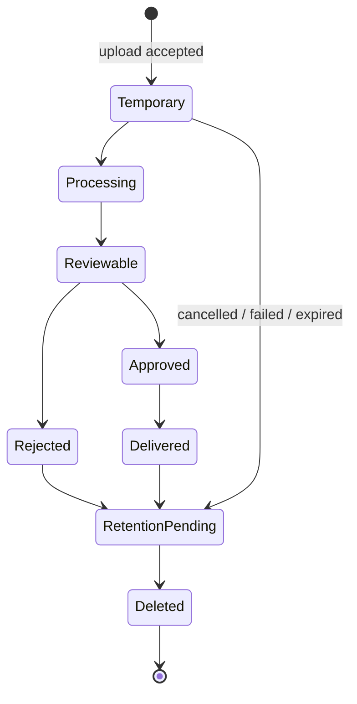

# CareTranslate Studio Architecture

- **System:** CareTranslate Studio

- **Current phase:** P0/P1 local evaluation baseline; P2 Azure platform deferred

- **Implementation baseline:** Current uncommitted evaluation tree; verify revision before release

- **Current architecture version:** `prd-local-4`

- **Canonical schema version:** `1.0`

- **Translation prompt version:** `translation-v3-multilingual-format-aware`

- **Last reviewed:** 2026-08-06

## 1. Purpose and scope

This document explains **how** CareTranslate Studio works. It records the current implementation separately from the approved production target so readers do not confuse roadmap components with deployed capabilities.

- Product intent and requirements: [PRD.md](./PRD.md)
- Data-security options and approval gates: [DATA-SECURITY.md](./DATA-SECURITY.md)
- Mandatory constraints: [RULES.md](./RULES.md)
- Stable current snapshot: [MEMORY.md](./MEMORY.md)
- Financial extraction contract and focused diagrams: [FINANCIAL-EXTRACTION.md](./FINANCIAL-EXTRACTION.md)

Status terms:

- **Current** — implemented in the repository.
- **Partial** — implemented incompletely or for limited scenarios.
- **Target** — approved production direction, not current behavior.
- **Proposed** — recommended direction awaiting accountable organizational approval.

## 2. System context

### 2.1 Implemented local evaluation context



The local baseline uses backend bearer-token authentication. It has no Entra identity, role/organization model, tenant isolation, assignment, or document ownership boundary; the development token is not production authorization.

### 2.2 Responsibility boundaries

- **Browser:** File selection, polling, PDF rendering, overlays, review views, downloads

- **Vinext server proxy:** Same-origin forwarding and server-only local bearer-token injection

- **FastAPI:** Validation, lifecycle API, safe errors, orchestration entry points

- **Worker:** Extraction, normalization, translation, validation, export

- **SQLite:** Document and job metadata

- **Local storage:** Source files, Azure results, canonical data, translations, pages, exports

- **Azure Document Intelligence:** Layout/OCR analysis and language hints

- **Azure OpenAI:** Schema-constrained English translation

Azure credentials are loaded by the backend only. The browser receives only
`NEXT_PUBLIC_API_BASE_URL`. The implemented Vinext route proxy injects the local backend bearer
token from server-only `API_AUTH_TOKEN`; it is credential containment, not user authentication
or object authorization.

## 3. Repository structure

```text
document-intelligence-platform/
├── backend/
│   ├── app/
│   │   ├── api/                 # FastAPI routes
│   │   ├── core/                # Settings, states, logging, exceptions
│   │   ├── database/            # Async SQLAlchemy engine/session
│   │   ├── dependencies/        # Application service container
│   │   ├── integrations/        # Azure clients and response mapping
│   │   ├── middleware/          # Request correlation
│   │   ├── models/              # SQLAlchemy models
│   │   ├── prompts/             # Versioned translation prompt
│   │   ├── repositories/        # Metadata persistence
│   │   ├── schemas/             # API and canonical Pydantic contracts
│   │   ├── services/            # Document, processing, language, validation, export
│   │   ├── storage/             # Storage protocol and local implementation
│   │   └── workers/             # In-process queue runner
│   ├── alembic/                 # Database migrations
│   ├── tests/                   # Backend unit/processing tests
│   └── Dockerfile
├── frontend/
│   ├── app/                     # Studio UI, API client, demo, PDF renderer, types
│   ├── build/                   # Hosting build plugin
│   ├── examples/                # Template example, not product behavior
│   ├── public/                  # PDF.js worker, CMaps, fonts, WASM, assets
│   ├── tests/                   # Server-rendered HTML tests
│   ├── worker/                  # Vinext/Cloudflare worker entry
│   └── .openai/hosting.json     # Frontend hosting metadata
├── scripts/                     # Windows setup/start helpers
├── docker-compose.yml           # Local evaluation API container
└── README.md
```

## 4. Current component design

### 4.1 Frontend

The frontend is a React 19 application using Vinext and Vite with Next.js-compatible APIs. `DocumentStudio` is a client component and owns the active document, pages, selection, hover, zoom, rotation, overlay, busy, and error state.

Current responsibilities:

- Start in a complete synthetic demo.
- Upload one document using multipart form data.
- Poll document metadata every 1.5 seconds for up to 240 attempts.
- Load page summaries first and fetch the current page JSON on demand.
- Render real PDFs using PDF.js.
- Render synthetic demo pages without a source PDF.
- Scale polygons to the page dimensions.
- Synchronize overlay hover/selection with text blocks and table cells.
- Display extracted, translated, and JSON tabs.
- Download page JSON and bilingual JSON.
- Retry failed documents.

Current limitations:

- Real non-PDF source files are still passed to the PDF renderer after page results exist.
- Browser refresh returns to the synthetic demo; active document identity is not routed or persisted.
- Financial correction, reconstructed-table acceptance/rejection, approval/rejection, and append-only audit history are implemented. Translation/block correction, assignment, organization ownership, and a general review queue remain targets.
- Service indicators report configuration presence only; they do not prove provider reachability.
- `chatgpt-auth.ts` and template examples are not connected to the product.

### 4.2 API

FastAPI is created in `backend/app/main.py`. At startup it builds a service container, initializes database tables, creates clients/services, starts the in-process worker, and enqueues non-terminal documents discovered in SQLite.

Cross-origin access is configured from `FRONTEND_ORIGINS` for direct API clients. The browser UI
uses the same-origin Vinext proxy; local document routes still validate a shared backend bearer
token. This is a development boundary, not production Entra/object authorization. CORS
credentials remain disabled because authentication is not cookie-based.

Application exceptions are returned using safe messages and a request identifier. Unexpected exceptions return a generic 500 response and are logged server-side.

### 4.3 Service container

The application constructs one process-local container containing:

- Settings
- Database engine/session factory
- Local artifact storage
- Document repository
- Document service
- Azure Document Intelligence analyzer
- Azure OpenAI translator
- Processing service
- In-process job runner

The container is closed during FastAPI shutdown.

### 4.4 Persistence

SQLAlchemy uses async sessions. SQLite enables foreign keys, WAL mode, and a five-second busy timeout. The application calls `Base.metadata.create_all()` at startup; Alembic also exists. Production must use migrations as the only schema-change mechanism.

### 4.5 Local artifact storage

Document paths are resolved below one configured root. Document IDs cannot escape that root. JSON is written through a temporary file followed by atomic replacement.

Local storage is an evaluation adapter behind the artifact-storage protocol. Production code will use Blob Storage rather than local paths.

## 5. Processing sequence



## 6. Document lifecycle



Current progress is stage-based rather than measured work. Document status is updated for each stage. Processing-job stage, leases, and continuing heartbeats are not fully implemented.

Terminal states are `completed`, `needs_review`, and `failed`.

## 7. Upload and file validation

The document service:

1. Reduces the uploaded name to a basename.
2. Replaces unsafe filename characters.
3. Enforces the configured extension set.
4. Creates a UUID document directory.
5. Streams one-megabyte chunks to a temporary file.
6. Enforces the configured byte limit while streaming.
7. Computes SHA-256.
8. Detects PDF, PNG, JPEG, TIFF, or BMP magic bytes.
9. Normalizes `jpeg` to `jpg` and `tif` to `tiff`.
10. Rejects an extension/signature mismatch.
11. Atomically moves the temporary upload to its source path.

Production additions: malware scanning, password/encryption detection, page-count policy, tenant quota, rate limiting, duplicate policy, content-disarm policy where approved, and cleanup if metadata creation fails after source persistence.

## 8. Azure Document Intelligence integration

The current analyzer uses `DocumentIntelligenceClient` with `AzureKeyCredential` and `prebuilt-layout`. It requests the `LANGUAGES` feature and returns `result.as_dict()`.

Configuration errors and service errors are converted to safe application errors. HTTP status codes commonly associated with transient failures are classified as retryable, but the application-specific retry settings are not directly applied to the Document Intelligence client.

Current gaps:

- API-key and managed-identity client construction are implemented, but managed-identity deployment
  evidence and private-network enforcement are not established.
- Language-span extraction is configurable; production configuration-drift evidence is not automated.
- Analyze results are deleted immediately with `(model_id, result_id)` when the SDK returns an ID,
  but deletion receipts, durable retry/alerting, and deployment evidence are not implemented.
- Azure currently exposes no classifier-result deletion operation; selective-classifier retention
  therefore remains an explicit production approval gate.
- The upload boundary enforces PDF encryption and page-count limits, but malware scanning and
  content-disarm controls remain production targets.

## 9. Canonical normalization

The mapper accepts both snake_case and camelCase Azure response keys.

### 9.1 Pages

For each Azure page it records:

- Page number and total page count
- Width, height, unit, and angle
- Page source text reconstructed from spans or lines

### 9.2 Text blocks

Paragraphs receive IDs shaped as `b000001`, a one-based reading order, source text, language hint, semantic role, spans, regions, and OCR confidence.

Confidence is a word-length-weighted mean for words overlapping the paragraph spans. Paragraphs at least 80% covered by table-cell spans are excluded from ordinary block output.

### 9.3 Tables

Tables receive IDs such as `t0001`; cells receive IDs such as `t0001-c0001`. Row/column positions, spans, kind, content, character spans, and regions are preserved.

Table cells receive Azure language hints by overlapping their spans with the provider language spans. OCR confidence is not currently mapped for cells. Language detection applies script fallbacks later when the provider returns no usable hint.

## 10. Language routing

The language service combines Azure language spans with conservative Unicode script fallbacks:

- Any syntactically valid provider BCP 47 source tag is normalized and retained; it is not checked against an Arabic/Chinese allowlist.
- Arabic hints/scripts normalize to `ar`; Chinese hints normalize to `zh-Hans` or `zh-Hant`.
- Han script without a reliable hint defaults to `zh-Hans`; mixed Arabic/Han plus Latin routes to `mixed`.
- A provider English hint normalizes to `en`. Latin script without a provider hint is `und`, because script alone cannot distinguish English, French, Spanish, and other languages.
- `und`, invalid tags, and non-linguistic `zxx` values are not routed to Azure OpenAI. Alphabetic unknown-language content becomes `needs_review`; numeric-only content is copied without translation.
- The mapper propagates provider language spans to paragraphs and table cells before batching.

This removes source-language restrictions from application routing, not from production assurance. Every advertised language/document family still requires extraction, translation, protected-token, PII-detection, and reviewer-correction benchmarks before enablement.

## 11. Translation architecture

Text blocks and table cells are translated through the same stable-ID contract. Table cells are represented internally as proxy text blocks and copied back to the cell schema after translation.

### 11.1 Routing

- Empty source: `not_required` with empty output.
- Any valid detected non-English BCP 47 tag, including `mixed`: `pending`, then translated.
- English: source copied to output with `not_required`.
- Unknown/invalid language with alphabetic content: `needs_review` with a warning and no silent language guess.
- Non-linguistic content: copied with `not_required`.
- Text confidence below 0.85: review flag and warning.

### 11.2 Batching and cache

Default limits are 40 blocks and 16,000 source characters, with up to 6 concurrent Azure OpenAI batch calls per document (`TRANSLATION_CONCURRENCY`). A batch hash includes the prompt version and serialized request. If the matching translation artifact exists, its response is validated and reused. A changed prompt version or input changes the hash.

### 11.3 Azure OpenAI call

The translator uses the Azure v1 base URL through `AsyncOpenAI`. It calls structured parsing with a Pydantic response schema, configured deployment, reasoning effort, completion-token limit, timeout, and bounded retry for connection, timeout, rate-limit, and internal-server failures.

The developer prompt declares source text untrusted, requires faithful English translation, preserves IDs/order/protected values, and gives explicit table-cell behavior.

### 11.4 Validation

The validator rejects:

- Missing, additional, or reordered IDs
- Duplicate IDs
- Empty translation for non-empty source
- Missing protected tokens

Protected-token matching currently uses regular expressions for URLs, emails, selected uppercase/case-code patterns, and numeric values. Production evaluation must include Unicode numerals, normalization, punctuation, names, and false-positive/false-negative analysis.

## 12. Extraction-before-translation guarantee

After normalization, the backend writes `normalized/extracted.json`, preliminary page JSON, page count, and source languages before translation starts. Therefore a translation failure does not discard successful OCR.

The final document becomes `failed`, while preliminary pages remain readable. Their embedded `document_status` remains the preliminary normalization status. A future contract should represent partial success explicitly rather than combining useful extraction with a generic failed state.

## 13. Data contracts

### 13.1 Canonical page

`PageResult` contains:

- `schema_version`
- `document_id`
- `document_status`
- Page metadata and source/translated text
- Text blocks
- Structured tables/cells
- Page warnings

### 13.2 Text block

- Stable ID and reading order
- Source and translated text
- Source language and translation status
- Optional role
- Source spans and bounding regions
- Optional OCR confidence and confidence source
- Review flag and warnings

### 13.3 Table cell

- Stable ID
- Row/column indices and spans
- Kind such as column header
- Source and translated content
- Source language and translation status
- Spans and bounding regions
- Review flag and warnings

### 13.4 Financial result

`financial-result-1.4` adds an ordered `content_items` stream to the existing table/validation payload:

- `heading`, `paragraph`, `key_value`, `list_item`, and `table` semantic types
- Stable source IDs, reading order, source pages, language, source/translated text, translated key/value subfields, geometry, relevance, warnings, and review state
- Table items reference the normalized table contract instead of flattening cells into narrative text
- Deterministic financial text signals plus the nearest preceding contextual heading; unrelated narrative blocks are excluded
- Source display text remains immutable; normalized values are separate derived fields
- Cell-level semantic types distinguish monetary amounts from measurements, percentage ranges,
  quantities, phones, dates/times, account numbers, identifiers, and unknown numeric values.
  Only explicit monetary correction flags participate in financial approval.
- Provider/effective table dimensions, cell origin, source-block IDs, integrity status, and
  reconciliation candidate IDs remain explicit
- Stored `financial-result-1.1` table-only artifacts remain readable in the frontend
  compatibility path. Pre-1.4 normalized display is withheld until controlled reprocessing
  creates 1.4 because the legacy artifact lacks semantic value types.


Breaking contract changes require a schema-version increment, migration plan, compatibility statement, frontend type update, and tests.

## 14. Database model

### `documents`

Stores source metadata, hash, status, progress, page count, source languages, target language, schema/processing versions, safe error, and timestamps.

### `processing_jobs`

Stores attempt, stage, job status, lease/heartbeat fields, safe error, and timestamps. Current code uses attempt/status/start/completion fields. Continuous stage, lease, and heartbeat behavior is incomplete.

### `translation_batches`

Designed to store batch hash, prompt/schema/model versions, status, attempt, block count, token usage, artifact path, and timestamps. Current processing does not create these records; translation tracking exists only in artifacts.

Production adds organizations, users/role mappings, document ownership, review assignments, result versions, corrections, approvals, audit events, retention policy, deletion jobs, and integration delivery records.

## 15. Artifact layout

```text
storage/documents/{document-id}/
├── source/original.{extension}
├── raw/document_intelligence.json
├── normalized/extracted.json
├── translations/batch-0001.json
├── pages/page-0001.json
├── exports/extracted-document.json
├── exports/bilingual-document.json
└── manifest.json
```

Sensitive content appears in the source, raw response, normalized extraction, translated responses, pages, and exports. Local artifacts currently persist until explicit deletion.

The financial artifact family additionally includes `classification/pages.json`,
`normalized/table-reconciliation.json`, `normalized/financial.json`,
`validation/financial.json`, and financial JSON/CSV/XLSX exports. The reconciliation artifact is
derived evidence; it does not replace `normalized/extracted.json`.

Production Blob paths must include an organization boundary, document ID, immutable result version, artifact kind, and retention metadata. Access should use short-lived authorized service operations rather than public URLs.

## 16. API surface

Base prefix: `/api/v1`

1. **Method:** GET
   - **Route:** `/health`, `/health/live`
   - **Current purpose:** Process liveness

2. **Method:** GET
   - **Route:** `/health/ready`
   - **Current purpose:** Static component readiness plus Azure configuration booleans

3. **Method:** GET
   - **Route:** `/health/dependencies`
   - **Current purpose:** Azure configuration/deployment metadata

4. **Method:** POST
   - **Route:** `/documents`
   - **Current purpose:** Validate, store, create metadata/job, enqueue

5. **Method:** GET
   - **Route:** `/documents`
   - **Current purpose:** Paginated document list

6. **Method:** GET
   - **Route:** `/documents/{id}`
   - **Current purpose:** Document metadata/status

7. **Method:** GET
   - **Route:** `/documents/{id}/source`
   - **Current purpose:** Inline source document

8. **Method:** GET
   - **Route:** `/documents/{id}/pages`
   - **Current purpose:** Page summaries

9. **Method:** GET
   - **Route:** `/documents/{id}/pages/{page}`
   - **Current purpose:** Canonical page JSON with ETag

10. **Method:** GET
   - **Route:** `/documents/{id}/classification`, `/documents/{id}/financial-result`,
     `/documents/{id}/financial-validation`, `/documents/{id}/table-reconciliation`,
     `/documents/{id}/financial-reviews`
   - **Current purpose:** Manifest-gated financial results, evidence, validation, and review history

11. **Method:** POST
   - **Route:** `/documents/{id}/financial-reviews`
   - **Current purpose:** Append a result-hash-bound correction, structure decision, and approval/rejection

12. **Method:** GET
   - **Route:** `/documents/{id}/downloads/{artifact}`
   - **Current purpose:** Page/extracted/bilingual/financial JSON and financial CSV/XLSX

13. **Method:** POST
   - **Route:** `/documents/{id}/retry`
   - **Current purpose:** Basic retry

14. **Method:** DELETE
   - **Route:** `/documents/{id}`
   - **Current purpose:** Delete a terminal document and metadata

Document routes currently require the configured local bearer token. Production must replace
this shared development credential with Entra identity, tenant/object authorization, and
permission-filtered operational metadata.

## 17. Error and recovery model

Safe application errors include configuration missing, not found, invalid document, conflict, Azure service failure, and translation validation failure. Responses include a safe code/message, request ID, retryability, and controlled details.

1. **Failure:** Invalid upload
   - **Current behavior:** Reject and clean temporary directory
   - **Production target:** Add malware/quota/policy evidence

2. **Failure:** Document Intelligence unavailable
   - **Current behavior:** Mark failed with safe error
   - **Production target:** Durable retry, circuit breaker, dead-letter visibility

3. **Failure:** Azure OpenAI unavailable
   - **Current behavior:** Preserve extraction; mark failed
   - **Production target:** Partial-success state and explicit retry mode

4. **Failure:** Invalid translation output
   - **Current behavior:** Mark failed
   - **Production target:** Batch-level retry/quarantine and reviewer visibility

5. **Failure:** Low OCR confidence
   - **Current behavior:** Mark needs review
   - **Production target:** Assignment and approval workflow

6. **Failure:** Application restart
   - **Current behavior:** Re-enqueue non-terminal documents
   - **Production target:** Durable queue/lease and idempotent stages

7. **Failure:** Browser poll timeout
   - **Current behavior:** Show error while backend may continue
   - **Production target:** Resumable routed document view and notifications

8. **Failure:** PDF preview failure
   - **Current behavior:** Retry preview; extraction remains independent
   - **Production target:** Format-aware preview fallback

## 18. Current security architecture

Implemented controls:

- Backend-only Azure configuration.
- Real environment files ignored by Git.
- Filename sanitization and upload size/signature validation.
- Document-scoped resolved storage paths.
- Atomic JSON replacement.
- Safe public application errors.
- Request correlation.
- Source text treated as untrusted prompt data.
- Structured translation output and protected-token validation.
- No document content intentionally logged in normal paths.

Current risks:

- No authentication, authorization, RBAC, organization, or ownership model.
- UUID knowledge is sufficient to read/download/delete terminal documents.
- Local disk and SQLite are not an approved sensitive-data platform.
- No malware scanning, rate limit, audit trail, retention worker, or legal hold.
- No private endpoints, managed identity, central monitoring, or key rotation workflow.
- Source/download responses do not define a complete sensitive-content cache policy.
- “Connected” and “Secure workspace” UI claims are static.

### 18.1 Current sensitive-data copies and trust boundaries

The current local baseline crosses two external managed-service boundaries and creates multiple local copies. This is acceptable only for synthetic or explicitly approved de-identified test data.

1. **Stage:** Browser upload/review
   - **Content exposed or stored:** Original file, page image, extracted and translated text
   - **Current boundary:** Local browser
   - **Production requirement:** Authenticated session, no-store responses, approved telemetry
     only, content cleared when no longer needed

2. **Stage:** API/local storage
   - **Content exposed or stored:** Original, raw analysis result, normalized extraction,
     batches, pages, exports
   - **Current boundary:** Local host filesystem
   - **Production requirement:** Private managed storage, organization boundary, least
     privilege, encryption, retention/deletion evidence

3. **Stage:** Document Intelligence
   - **Content exposed or stored:** Original document and analysis result
   - **Current boundary:** Azure managed service
   - **Production requirement:** Route approved by classification; regional/private service or
     controlled-boundary container; immediate result deletion

4. **Stage:** Azure OpenAI
   - **Content exposed or stored:** Full extracted source text in translation batches and
     generated English
   - **Current boundary:** Azure managed service
   - **Production requirement:** Synthetic local evaluation only; production normally receives only approved
     minimized/pseudonymized blocks, with raw content prohibited without `GENAI_RAW_EXCEPTION`

5. **Stage:** Metadata/logging
   - **Content exposed or stored:** Names, IDs, status, provider metadata, errors
   - **Current boundary:** Local app/SQLite/logs
   - **Production requirement:** Content-free structured telemetry, pseudonymous IDs, restricted
     audit store, retention policy

### 18.2 Proposed processing-profile boundary

The server-side policy gateway must select the route before any content crosses an external boundary:

1. **Profile:** `GENAI_SYNTHETIC_POC` (persisted compatibility identifier)
   - **Extraction route:** Current Azure Document Intelligence
   - **Translation route:** Current Azure OpenAI
   - **Generative LLM exposure:** Yes; raw extracted non-English blocks may be submitted
   - **Permitted use:** Synthetic or explicitly approved de-identified testing only
   - **Status:** Current local-evaluation constraint

2. **Profile:** `GENAI_PSEUDONYMIZED`
   - **Extraction route:** Regional/private Document Intelligence with immediate result deletion
   - **Translation route:** Minimum approved blocks through a hardened single-region Azure
     OpenAI deployment
   - **Generative LLM exposure:** Yes; pseudonymized content only
   - **Permitted use:** Approved Azure OpenAI-enabled production classifications
   - **Status:** Production target

3. **Profile:** `MANAGED_NO_LLM`
   - **Extraction route:** Regional/private Document Intelligence with immediate result deletion
   - **Translation route:** Regional/private Azure AI Translator
   - **Generative LLM exposure:** No
   - **Permitted use:** Microsoft regional processing allowed; generative AI prohibited
   - **Status:** Production target

4. **Profile:** `RESTRICTED_LOCAL`
   - **Extraction route:** Approved connected/disconnected Document Intelligence container
   - **Translation route:** Approved Translator container or authorized human review
   - **Generative LLM exposure:** No
   - **Permitted use:** Content cannot leave the controlled boundary
   - **Status:** Production target

5. **Profile:** `GENAI_RAW_EXCEPTION`
   - **Extraction route:** Approved regional/private service or container
   - **Translation route:** Hardened single-region Azure OpenAI
   - **Generative LLM exposure:** Yes; exact raw fields named by a valid exception
   - **Permitted use:** Narrow, written and time-bounded exceptional use
   - **Status:** Open decision

6. **Profile:** `HUMAN_ONLY`
   - **Extraction route:** None or approved local extraction
   - **Translation route:** Authorized human workflow
   - **Generative LLM exposure:** No
   - **Permitted use:** Automated processing prohibited
   - **Status:** Required fallback

- **Unknown classification, jurisdiction or policy:** Fail closed to quarantine/manual review

- **Expired or invalid raw exception:** Deny `GENAI_RAW_EXCEPTION`

- **Provider-control drift or unavailable approved route:** Stop processing; do not downgrade or
  fail over

- **Frontend, retry path, dependency failure or operator requests a weaker route:** Reject the
  request and retain the immutable backend profile

The full control set is in [DATA-SECURITY.md](./DATA-SECURITY.md).

## 19. Current deployment

### Local Windows

- `scripts/setup.ps1` creates environment files, Python virtual environment, installs dependencies, and runs `npm ci`.
- `scripts/run-local.ps1` opens backend and frontend PowerShell processes;
  `run-poc.ps1` is a deprecated compatibility shim only.
- FastAPI listens on `127.0.0.1:8000` with reload.
- Vinext listens on `localhost:3000`.

### Local evaluation Docker

Docker Compose builds only the API, maps port 8000, reads `backend/.env`, and mounts local `data` and `storage`. The image runs one Uvicorn worker.

### Frontend hosting scaffold

The frontend contains OpenAI Sites/Cloudflare configuration, a Vinext worker entry, and an empty D1 setup. D1 is not used by CareTranslate Studio. The backend does not have a corresponding production deployment in the repository.

There is no CI/CD, infrastructure as code, automated migration job, production ingress/TLS definition, SBOM, backup process, or operational runbook.

## 20. Production target architecture

The managed platform components are the production target. The profile-based provider routing below is the proposed security refinement and remains subject to the approvals in `DATA-SECURITY.md`.

**Backend architecture (API platform — sellable without UI):** [diagrams/README.md](./diagrams/README.md) · [diagrams/multilingual-translator-studio-backend-architecture.png](./diagrams/multilingual-translator-studio-backend-architecture.png)



This is the **proposed production target**, not the current implementation. The service-level control matrix and management decisions are maintained in [DATA-SECURITY.md](./DATA-SECURITY.md).

### Service responsibilities and permitted data

1. **Boundary:** Identity and edge
   - **Primary services:** Entra ID, Front Door Premium WAF, API Management
   - **Responsibility:** Authenticate, filter, validate tokens and limit requests
   - **Maximum normal data exposure:** Identity/request metadata; edge logs exclude document
     bodies
   - **Exposed to generative LLM?:** No

2. **Boundary:** Intake
   - **Primary services:** Container Apps API, Blob quarantine, Defender for Storage
   - **Responsibility:** Object authorization, file validation and malware disposition
   - **Maximum normal data exposure:** Full upload inside the approved private boundary
   - **Exposed to generative LLM?:** No

3. **Boundary:** Orchestration
   - **Primary services:** Event Grid, Service Bus Premium, Container Apps worker
   - **Responsibility:** Durable job execution with an immutable processing profile
   - **Maximum normal data exposure:** IDs, hashes and policy metadata in messages
   - **Exposed to generative LLM?:** No

4. **Boundary:** Extraction
   - **Primary services:** Private regional Azure Document Intelligence
   - **Responsibility:** OCR/layout extraction followed by immediate result deletion
   - **Maximum normal data exposure:** Full document and result temporarily
   - **Exposed to generative LLM?:** No; DI does not call Azure OpenAI automatically

5. **Boundary:** Data Security Gateway
   - **Primary services:** Private internal Container Apps service, policy engine, self-hosted
     multilingual PII/custom recognizers, tokenization service, Key Vault/Managed HSM
   - **Responsibility:** Minimize, pseudonymize, authorize and fail closed
   - **Maximum normal data exposure:** Raw extracted text remains inside the controlled boundary
   - **Exposed to generative LLM?:** No; it controls what may be submitted

6. **Boundary:** Generative processing
   - **Primary services:** Private single-region Azure OpenAI
   - **Responsibility:** Approved translation and future generative features
   - **Maximum normal data exposure:** Minimum pseudonymized blocks for the normal route
   - **Exposed to generative LLM?:** **Yes; only this approved request reaches the LLM**

7. **Boundary:** Validation and review
   - **Primary services:** Schema/leakage validators, CareTranslate review UI
   - **Responsibility:** Verify coverage, tokens, fidelity and human approval
   - **Maximum normal data exposure:** Authorized source/result only
   - **Exposed to generative LLM?:** No additional exposure

8. **Boundary:** Persistence and operations
   - **Primary services:** Private Blob, PostgreSQL, Monitor/Sentinel, retention worker
   - **Responsibility:** Tenant isolation, versioning, evidence, detection and deletion
   - **Maximum normal data exposure:** Approved artifacts plus content-free operational metadata
   - **Exposed to generative LLM?:** No

### Target properties

1. **Architecture area:** Compute
   - **Target component or rule:** Separate Azure Container Apps API and workers
   - **Data/LLM protection:** Prevents user-facing API failures from bypassing worker policy
   - **Status:** Production target

2. **Architecture area:** Orchestration
   - **Target component or rule:** Azure Service Bus durable commands, retry, lock renewal and
     dead-letter handling
   - **Data/LLM protection:** Commands carry IDs/policy metadata, not document content
   - **Status:** Production target

3. **Architecture area:** Metadata
   - **Target component or rule:** Azure Database for PostgreSQL
   - **Data/LLM protection:** Stores ownership, attempts, versions, approvals and content-free
     audit events
   - **Status:** Production target

4. **Architecture area:** Artifacts
   - **Target component or rule:** Private Azure Blob Storage
   - **Data/LLM protection:** Encrypted, versioned, tenant-scoped artifacts with lifecycle
     policies
   - **Status:** Production target

5. **Architecture area:** User identity
   - **Target component or rule:** Microsoft Entra ID + backend authorization
   - **Data/LLM protection:** Authenticates users and enforces organization/role at the API and
     data layers
   - **Status:** Production target

6. **Architecture area:** Policy
   - **Target component or rule:** Backend processing-policy gateway
   - **Data/LLM protection:** Assigns an immutable profile before any external content call
   - **Status:** Production target

7. **Architecture area:** Normal generative route
   - **Target component or rule:** `GENAI_PSEUDONYMIZED`
   - **Data/LLM protection:** Azure OpenAI receives only approved minimized/pseudonymized blocks
   - **Status:** Proposed route

8. **Architecture area:** Non-generative route
   - **Target component or rule:** `MANAGED_NO_LLM`
   - **Data/LLM protection:** No generative LLM exposure
   - **Status:** Proposed route

9. **Architecture area:** Controlled-boundary route
   - **Target component or rule:** `RESTRICTED_LOCAL`
   - **Data/LLM protection:** No managed-cloud document/LLM exposure for content
   - **Status:** Proposed route

10. **Architecture area:** Raw generative route
   - **Target component or rule:** `GENAI_RAW_EXCEPTION`
   - **Data/LLM protection:** Raw Azure OpenAI exposure only under exact valid approval
   - **Status:** Open decision

11. **Architecture area:** Workload identity
   - **Target component or rule:** Managed identities
   - **Data/LLM protection:** Removes long-lived application keys where supported
   - **Status:** Production target

12. **Architecture area:** Secrets and token keys
   - **Target component or rule:** Key Vault/Managed HSM
   - **Data/LLM protection:** Holds keys/credentials only; never source text
   - **Status:** Production target

13. **Architecture area:** Network
   - **Target component or rule:** Private endpoints, private DNS and network rules
   - **Data/LLM protection:** Blocks unapproved public data-plane access
   - **Status:** Production target

14. **Architecture area:** Egress governance
   - **Target component or rule:** Azure Firewall and Azure Policy
   - **Data/LLM protection:** Denies unapproved endpoints, regions, authentication modes and
     model deployment types
   - **Status:** Production target

15. **Architecture area:** Observability
   - **Target component or rule:** Application Insights, Azure Monitor and Sentinel
   - **Data/LLM protection:** Receives content-free logs, metrics, traces and alerts
   - **Status:** Production target

16. **Architecture area:** Deletion
   - **Target component or rule:** Retention worker + immediate Document Intelligence result
     deletion
   - **Data/LLM protection:** Deletes application copies and requests provider-result deletion
     with evidence
   - **Status:** Production target

The approved Azure region, processor permission, model deployment type, container entitlement, RPO/RTO, and organization-level tenancy model remain release decisions.

### 20.1 Policy gateway contract

1. **Contract group:** Identity and ownership
   - **Required fields or rule:** Organization ID, document ID and attempt ID
   - **Enforced by:** API and worker

2. **Contract group:** Integrity and versioning
   - **Required fields or rule:** Source hash, policy version and selected profile
   - **Enforced by:** Policy gateway and worker

3. **Contract group:** Provider boundary
   - **Required fields or rule:** Allowed provider/service feature, region and deployment type
   - **Enforced by:** Worker and provider adapter

4. **Contract group:** Exception control
   - **Required fields or rule:** Exception ID, scope and expiry where applicable
   - **Enforced by:** Policy gateway and worker

5. **Contract group:** Lifecycle
   - **Required fields or rule:** Retention class and required provider/application deletion
     behavior
   - **Enforced by:** Worker and retention service

6. **Contract group:** Independent enforcement
   - **Required fields or rule:** Worker validates the complete contract against active policy
   - **Enforced by:** Worker

7. **Contract group:** No client provider choice
   - **Required fields or rule:** Provider adapters accept an approved policy decision, not a
     free-form client provider name
   - **Enforced by:** API, worker and adapter

8. **Contract group:** No silent fallback
   - **Required fields or rule:** No adapter may fail over to another provider, region,
     deployment type or profile
   - **Enforced by:** Adapter and egress policy

### 20.2 Azure OpenAI profile architecture

1. **Azure OpenAI control area:** Input content
   - **`GENAI_PSEUDONYMIZED`:** Minimum required, locally pseudonymized blocks
   - **`GENAI_RAW_EXCEPTION`:** Only exact raw fields named by signed approval
   - **Mandatory shared control:** Minimal batches and explicit block boundaries

2. **Azure OpenAI control area:** Mapping
   - **`GENAI_PSEUDONYMIZED`:** Separately encrypted and authorized re-identification map
   - **`GENAI_RAW_EXCEPTION`:** Mapping retained for every transformed field
   - **Mandatory shared control:** Excluded from prompts/logs and deleted with the document

3. **Azure OpenAI control area:** Fail-closed conditions
   - **`GENAI_PSEUDONYMIZED`:** Low PII confidence, missing policy, token mismatch or
     unavailable approved deployment
   - **`GENAI_RAW_EXCEPTION`:** Missing/expired scope, purpose, approver or compensating control
   - **Mandatory shared control:** Stop; never downgrade or fail over

4. **Azure OpenAI control area:** Route selection
   - **`GENAI_PSEUDONYMIZED`:** Backend policy only
   - **`GENAI_RAW_EXCEPTION`:** Separate route requiring signed exception
   - **Mandatory shared control:** Frontend, retry logic and outage handling cannot select it

5. **Azure OpenAI control area:** Deployment
   - **`GENAI_PSEUDONYMIZED`:** Dedicated single-region Standard or Regional Provisioned
     deployment
   - **`GENAI_RAW_EXCEPTION`:** Same
   - **Mandatory shared control:** Private endpoint, managed identity and verified modified
     abuse monitoring

6. **Azure OpenAI control area:** API behavior
   - **`GENAI_PSEUDONYMIZED`:** Stateless request/response only
   - **`GENAI_RAW_EXCEPTION`:** Same
   - **Mandatory shared control:** Content-free observability and provider kill switch

7. **Azure OpenAI control area:** Prohibited features
   - **`GENAI_PSEUDONYMIZED`:** Global, DataZone, stateful APIs, Batch, stored completions,
     fine-tuning, Files, Threads, Assistants, vector stores and unapproved previews
   - **`GENAI_RAW_EXCEPTION`:** Same unless separately assessed and explicitly approved
   - **Mandatory shared control:** Enforced by adapter, policy and deployment controls

### 20.3 Provider deletion and evidence

After Document Intelligence returns a complete analysis result, the worker persists only the artifacts permitted by the selected profile and immediately requests Delete Analyze Result. The deletion command is idempotent and has a durable retry path, deadline alert, and content-free receipt. The provider's documented 24-hour automatic deletion window is a maximum fallback, not application retention.

Application deletion separately covers sources, raw results, normalized extraction, translation artifacts, pages, previews, exports, caches, queues, indexes, pseudonym mappings, versions, soft-delete windows, and backup expiry. Legal holds are explicit and audited.

## 21. Production processing and versioning

Each processing command must include organization ID, document ID, attempt ID, requested retry mode, expected source hash, schema version, processing version, and policy version.

Approved retry modes:

1. **Resume** — reuse all valid artifacts and continue from the failed stage.
2. **Retranslate** — reuse extraction and create new translation/result versions.
3. **Reprocess completely** — perform fresh extraction and translation as a new version.

Approved results are immutable. Corrections create a human-reviewed version linked to the machine result. Exports identify their source version and approval status.

## 22. Production identity and authorization

- The web application obtains an Entra token.
- The API validates issuer, audience, signature, time, tenant policy, and required scopes/roles.
- The API derives the organization and subject from trusted claims, not request body fields.
- Repository/storage queries include the authorized organization boundary.
- Review assignments and actions are checked server-side.
- Operator break-glass access is time-limited, justified, and audited.
- Audit events record subject, organization, action, resource ID, result, time, policy/version, and request correlation without source content.

## 23. Production data lifecycle



- Default temporary workspace retention: 30 days.
- Organization-configurable range: 1–90 days subject to approved policy.
- Audit metadata default: one year without document text.
- Approved exports should move to the official record system.
- Legal hold, if required, must be explicit, authorized, scoped, and auditable.
- Azure Document Intelligence analyze results must be deleted immediately after retrieval, with durable retry, overdue alerting, and content-free evidence.
- Deletion must cover source, raw extraction, translations, pages, exports, indexes, caches, and backups according to policy.

## 24. Health and observability target

Liveness should answer whether the process can respond. Readiness should actively verify required local/managed dependencies with bounded timeouts. External AI readiness should distinguish configured, reachable, degraded, throttled, and unavailable without exposing secret or deployment details publicly.

Required measures:

- API request count, latency, status, and throttling.
- Queue depth, oldest-message age, retry, lock loss, and dead letters.
- Stage count/duration/failure by version and dependency.
- Document Intelligence pages and errors.
- Azure AI Translator and approved Azure OpenAI profile calls, latency, errors, validation results, region/deployment metadata, and cost/usage without content.
- Processing-profile selection, denial, expired exception, downgrade attempt, unapproved egress, and provider-result deletion status.
- Review-required, correction, rejection, and approval rates.
- Retention backlog/failure and storage utilization.
- No source or translated content in logs, metrics, or traces.

## 25. Quality and delivery architecture

Production delivery requires:

- Pull-request CI for Python lint, type checking, tests, coverage, and migration checks.
- Frontend lint, type checking, build, unit/component tests, and browser tests.
- Secret scanning, dependency review, vulnerability scanning, container scanning, and SBOM.
- Synthetic E2E tests for upload through export.
- Infrastructure-plan review and controlled environment promotion.
- Database migration before application rollout, with rollback/forward-fix strategy.
- Deployment health checks, smoke tests, and automated rollback criteria.

## 26. Known implementation gaps

1. The shared local bearer-token boundary is not Entra authentication, tenant isolation, RBAC, or
   object-level authorization.
2. Live image preview does not yet match every accepted input format.
3. In-process workers, local storage, and SQLite are local-evaluation components only.
4. Distributed queue delivery, dead-lettering, cancellation, and multi-worker recovery are not
   implemented on Azure infrastructure.
5. Health reports configuration plus local DB/storage/worker readiness; it does not actively probe
   paid Azure providers. The UI now labels that state as “Configured,” not “Available.”
6. Managed-identity and private-network configuration lack deployed evidence and drift enforcement.
7. Financial correction and approval are implemented locally; general translation correction,
   assignment, tenant authorization, and reviewed-export materialization remain targets.
8. Analyze-result deletion is best-effort and immediate for document-model results, without durable
   receipts/retry/alerting; Azure has no classifier-result deletion operation.
9. Retention automation, legal hold, quarantine, malware scanning, and deletion evidence are absent.
10. No repository CI/CD, SBOM/container gate, or complete Azure production deployment exists.
11. The lightweight pseudonymization gateway is not an approved multilingual PII detector or
    separately protected production token-map service.
12. No Azure AI Translator or Document Intelligence/Translator container adapter exists.
19. Private endpoints, managed identity enforcement, egress restrictions, allowed-region/deployment policy, and modified-abuse-monitoring verification are not implemented.

## 27. Architecture decision records

Material changes should create an ADR under `docs/adr/` rather than expanding this document with chronological history. ADRs should capture context, considered options, decision, consequences, security/data impact, migration, rollback, and status.

Initial ADR candidates:

- Azure Container Apps for API and worker.
- Service Bus delivery/idempotency model.
- Blob artifact naming and organization isolation.
- PostgreSQL tenancy strategy.
- Entra role/permission model.
- Result and correction versioning.
- Retention/deletion enforcement.
- Processing-profile model and fail-closed Data Security Gateway.
- Azure OpenAI regional deployment, modified abuse-monitoring verification, and prohibited-feature policy.
- Data classification, processing profiles, and approved extraction/translation providers.
- Generative-AI exception and pseudonymization boundary, if management permits the exception.
- Frontend hosting and same-origin/API strategy.

## 28. Financial-only extraction architecture increment

**Implemented:** financial extraction is an additive stage around the existing canonical mapper. `post_extract` keeps the original full-layout behavior and derives a classification manifest with deterministic layout rules. `selective` uses the same Document Intelligence client boundary to call a configured custom classifier, converts its page ranges into conservative decisions, groups selected pages into bounded contiguous ranges, and reuses the existing stable-ID range extractor.

```mermaid
flowchart LR
    Source["Immutable source"] --> Policy["Existing backend profile decision"]
    Policy --> Mode{"Stored financial mode"}
    Mode -->|"post_extract - full-layout evaluation"| Layout["Full layout extraction"]
    Layout --> Provider["Immutable provider extraction"]
    Mode -->|"selective"| Classifier["Azure DI custom classifier"]
    Classifier --> Selector["Recall-first candidate selector"]
    Selector --> Ranges["Selected contiguous page ranges"]
    Ranges --> LayoutSelected["Detailed layout extraction"]
    LayoutSelected --> Provider
    Provider --> Reconcile["Versioned aligned-column reconciliation"]
    Reconcile -->|post_extract| Rules["Deterministic financial page rules"]
    Reconcile -->|selective| Normalize["Contextual financial normalization and validation"]
    Rules --> Normalize
    Normalize --> Project["Ordered financial-only semantic projection"]
    Project --> Results["Versioned JSON, CSV, XLSX and page index"]
    Results --> UI["Page-scoped source / English review UI"]
    UI --> Decision["Corrections + structure accept/reject + result-hash audit"]
```



Artifacts are stored under `classification/`, `normalized/`, `validation/`, and `exports/`.
`normalized/extracted.json` is immutable provider output; the separate
`normalized/table-reconciliation.json` records derived structural evidence. SQLite summary
columns and append-only financial correction/structure reviews are Alembic-managed in the local
baseline. Blob, Service Bus, PostgreSQL, Entra tenant authorization, private networking, and
malware scanning remain P2 targets. See [FINANCIAL-EXTRACTION.md](./FINANCIAL-EXTRACTION.md) for
table integrity, review, reprocess, and experiment diagrams.

## 29. References

- [Product requirements](./PRD.md)
- [Data security and AI processing plan](./DATA-SECURITY.md)
- [Rules](./RULES.md)
- [Memory](./MEMORY.md)
- [Financial extraction engine](./FINANCIAL-EXTRACTION.md)
- Project root `README.md`
- [Azure Document Intelligence data, privacy, and security](https://learn.microsoft.com/en-us/azure/foundry/responsible-ai/document-intelligence/data-privacy-security)
- [Azure OpenAI data, privacy, and security](https://learn.microsoft.com/en-us/azure/foundry/responsible-ai/openai/data-privacy)
- [Azure OpenAI abuse monitoring](https://learn.microsoft.com/en-us/azure/foundry/openai/concepts/abuse-monitoring)
- [Azure AI model deployment types](https://learn.microsoft.com/en-us/azure/foundry/foundry-models/concepts/deployment-types)
- [Azure AI Translator data, privacy, and security](https://learn.microsoft.com/en-us/azure/foundry/responsible-ai/translator/data-privacy-security)
- [Azure AI Translator containers](https://learn.microsoft.com/en-us/azure/ai-services/translator/containers/overview)
- [Azure managed identities](https://learn.microsoft.com/en-us/entra/identity/managed-identities-azure-resources/overview)
- [Azure Key Vault security](https://learn.microsoft.com/en-us/azure/key-vault/general/secure-key-vault)
