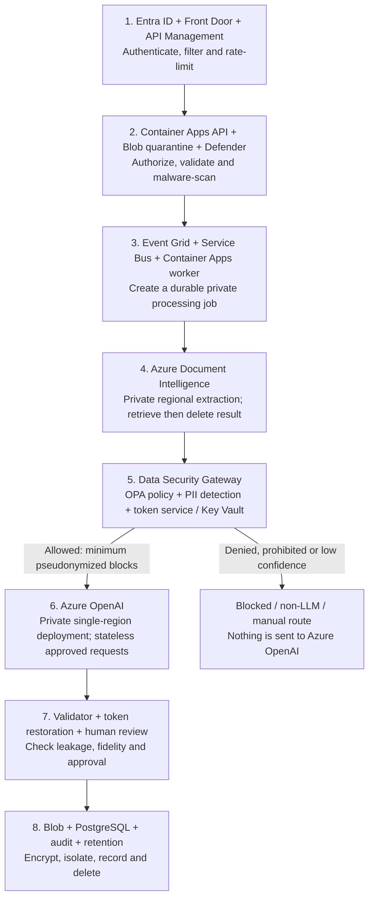
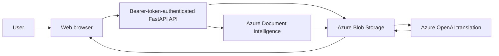
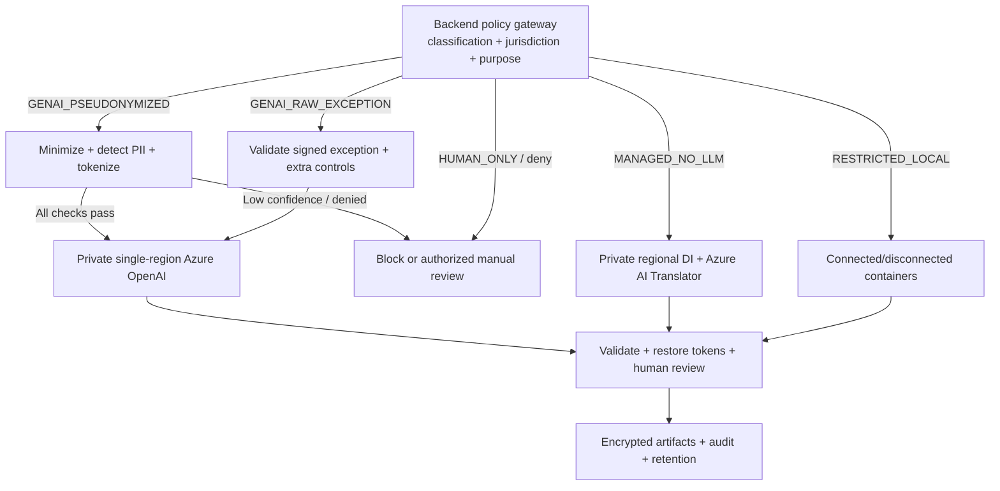

# CareTranslate Studio Data Security and AI Processing Plan

- **Document type:** Management decision paper and production security plan

- **Status:** Proposed for management, security, privacy, legal, and architecture review

- **Applies to:** Current implementation and production roadmap

- **Information in scope:** Uploaded documents, page images, extracted text, translations,
  review data, exports, and operational metadata

- **Last reviewed:** 2026-08-06

> **Important:** This document describes proposed production controls. It is not evidence that those controls are deployed. The current implementation has bearer-token authentication plus an organization/ownership/role authorization layer, but not Entra ID federation, and not the full P2 platform control set (private networking, managed identities, malware scanning, retention automation). It uses Azure Document Intelligence and Azure OpenAI and is approved only for synthetic or explicitly approved de-identified test data until the remaining gates in this document are closed.

## 1. Executive recommendation

1. **Policy ID:** SEC-01
   - **Recommended production policy:** Do not send raw confidential or restricted document
     content to a generative LLM by default
   - **Applies to:** Every production document
   - **LLM exposure position:** Raw LLM exposure prohibited by default
   - **Approval status:** Proposed

2. **Policy ID:** SEC-02
   - **Recommended production policy:** Retain Azure OpenAI for approved translation and future
     features, but normally submit only minimum deterministically pseudonymized blocks through
     the Data Security Gateway
   - **Applies to:** Approved Azure OpenAI-enabled workloads
   - **LLM exposure position:** Pseudonymized minimum blocks only
   - **Approval status:** Proposed

3. **Policy ID:** SEC-03
   - **Recommended production policy:** Select the processing profile on the backend before any
     external call using classification, jurisdiction, organization policy and verified provider
     controls
   - **Applies to:** All automated processing
   - **LLM exposure position:** Prevents unauthorized LLM exposure
   - **Approval status:** Proposed

4. **Policy ID:** SEC-04
   - **Recommended production policy:** Use regional/private Document Intelligence plus Azure AI
     Translator when Microsoft regional processing is allowed but generative AI is prohibited
   - **Applies to:** `MANAGED_NO_LLM`
   - **LLM exposure position:** No generative LLM exposure
   - **Approval status:** Proposed

5. **Policy ID:** SEC-05
   - **Recommended production policy:** Use connected/disconnected Document Intelligence and
     Translator containers when content cannot leave the controlled boundary
   - **Applies to:** `RESTRICTED_LOCAL`
   - **LLM exposure position:** No generative LLM exposure
   - **Approval status:** Proposed

6. **Policy ID:** SEC-06
   - **Recommended production policy:** Allow raw Azure OpenAI processing only through a
     written, time-bounded exception naming the exact data class and purpose
   - **Applies to:** `GENAI_RAW_EXCEPTION`
   - **LLM exposure position:** Raw LLM exposure only by explicit exception
   - **Approval status:** Open decision

7. **Policy ID:** SEC-07
   - **Recommended production policy:** Require human review for safety-critical or legally
     consequential translations; output remains decision support
   - **Applies to:** Every reviewable result
   - **LLM exposure position:** No additional LLM exposure during human approval
   - **Approval status:** Proposed

- **Production data-processing policy:** CareTranslate Studio will retain Azure OpenAI for
  approved translation and future capabilities, but will not send raw confidential or restricted
  records to it by default. Every document will receive a backend-enforced processing profile.
  The normal Azure OpenAI-enabled route will send only approved, minimized, pseudonymized blocks
  through a private single-region deployment. Records that cannot use generative AI will use an
  approved non-LLM, local, or human-only route. Raw Azure OpenAI processing requires a separate,
  written, time-bounded exception and complete audit evidence.

### 1.1 Secure Azure OpenAI-enabled production flow

> **Proposed production target — not implemented in the current implementation.** The diagram is intentionally compact so that it remains readable in GitHub and document previews.

1. **Component:** Data Security Gateway
   - **Meaning:** Application security boundary; not a single Azure product
   - **Proposed hosting:** Private internal Azure Container Apps service
   - **Required functions:** Server-side policy evaluation, data minimization, multilingual PII
     detection, deterministic tokenization, separately encrypted re-identification map and
     fail-closed routing
   - **Implementation status:** Production target; not implemented in the current implementation

### 1.2 Which service protects which part

1. **Stage:** Identity
   - **Azure/application service:** Microsoft Entra ID
   - **Data handled:** Identity and authorization metadata
   - **Microsoft-managed processing?:** Yes
   - **Exposed to generative LLM?:** No
   - **Required production protection:** MFA, Conditional Access, app roles, managed identities
     and access reviews
   - **Status:** Production target

2. **Stage:** Internet edge
   - **Azure/application service:** Azure Front Door Premium WAF
   - **Data handled:** Request/security metadata; upload traffic transits the edge
   - **Microsoft-managed processing?:** Yes
   - **Exposed to generative LLM?:** No
   - **Required production protection:** TLS, managed WAF rules, rate controls, private origin
     and no document-body logging
   - **Status:** Production target

3. **Stage:** API boundary
   - **Azure/application service:** Azure API Management + Container Apps API
   - **Data handled:** Complete upload while accepting the request
   - **Microsoft-managed processing?:** Yes
   - **Exposed to generative LLM?:** No
   - **Required production protection:** JWT validation, backend object authorization, private
     ingress, payload limits and body logging disabled
   - **Status:** Production target

4. **Stage:** Upload quarantine
   - **Azure/application service:** Azure Blob Storage + Defender for Storage
   - **Data handled:** Complete uploaded document
   - **Microsoft-managed processing?:** Yes
   - **Exposed to generative LLM?:** No
   - **Required production protection:** Private quarantine, on-upload malware scanning and
     clean-event promotion
   - **Status:** Production target

5. **Stage:** Job control
   - **Azure/application service:** Event Grid + Service Bus Premium
   - **Data handled:** IDs and immutable policy metadata only
   - **Microsoft-managed processing?:** Yes
   - **Exposed to generative LLM?:** No
   - **Required production protection:** Duplicate protection, bounded retries, dead-letter
     review and no document body in messages
   - **Status:** Production target

6. **Stage:** Extraction
   - **Azure/application service:** Azure Document Intelligence
   - **Data handled:** Complete source and analysis result temporarily
   - **Microsoft-managed processing?:** Yes
   - **Exposed to generative LLM?:** **No; DI does not automatically call Azure OpenAI**
   - **Required production protection:** Approved region, private endpoint, managed identity,
     public access disabled and immediate Delete Analyze Result call
   - **Status:** Production target

7. **Stage:** Data Security Gateway
   - **Azure/application service:** Private internal Container Apps + policy engine +
     self-hosted PII/custom recognizers
   - **Data handled:** Raw extracted text inside controlled application boundary
   - **Microsoft-managed processing?:** Azure hosts compute; company logic controls the content
   - **Exposed to generative LLM?:** No; it decides what may be sent
   - **Required production protection:** Classification, minimization, multilingual detection,
     deterministic tokenization, confidence threshold and fail closed
   - **Status:** Production target

8. **Stage:** Token keys
   - **Azure/application service:** Azure Key Vault or Managed HSM
   - **Data handled:** Token-map encryption keys and workload secrets
   - **Microsoft-managed processing?:** Yes
   - **Exposed to generative LLM?:** No
   - **Required production protection:** Separate keys, managed identity, RBAC, rotation and
     deletion alignment; never store source text
   - **Status:** Production target

9. **Stage:** Generative AI
   - **Azure/application service:** Private single-region Azure OpenAI
   - **Data handled:** Normally minimum approved pseudonymized blocks and model output
   - **Microsoft-managed processing?:** Yes
   - **Exposed to generative LLM?:** **Yes; submitted prompt blocks are processed by the LLM**
   - **Required production protection:** Dedicated deployment, private endpoint, managed
     identity, verified modified abuse-monitoring status, stateless APIs and prohibited stateful
     features
   - **Status:** Production target/open approval

10. **Stage:** Output validation
   - **Azure/application service:** Pydantic/custom validators + PII scanner
   - **Data handled:** Model output before controlled token restoration
   - **Microsoft-managed processing?:** Application-controlled
   - **Exposed to generative LLM?:** No additional exposure
   - **Required production protection:** Stable IDs, strict schema, token/coverage checks,
     multilingual leakage scan and fail closed
   - **Status:** Production target

11. **Stage:** Accountability
   - **Azure/application service:** CareTranslate review UI
   - **Data handled:** Authorized source and translated result
   - **Microsoft-managed processing?:** Application/browser on Azure-hosted platform
   - **Exposed to generative LLM?:** No additional exposure
   - **Required production protection:** RBAC, assignment, audit, no-store responses and secure
     session/download controls
   - **Status:** Production target

12. **Stage:** Durable storage
   - **Azure/application service:** Private Blob Storage + Azure Database for PostgreSQL
   - **Data handled:** Approved artifacts and minimum metadata
   - **Microsoft-managed processing?:** Yes
   - **Exposed to generative LLM?:** No
   - **Required production protection:** Private endpoints, encryption, organization scoping and
     short-lived downloads
   - **Status:** Production target

13. **Stage:** Detection
   - **Azure/application service:** Azure Monitor + Application Insights + Microsoft Sentinel
   - **Data handled:** Operational/security metadata only
   - **Microsoft-managed processing?:** Yes
   - **Exposed to generative LLM?:** No
   - **Required production protection:** Content-free telemetry, canary leakage tests and
     restricted security-log access
   - **Status:** Production target

14. **Stage:** Configuration enforcement
   - **Azure/application service:** Azure Policy + Defender for Cloud + Azure Firewall
   - **Data handled:** Configuration and traffic metadata only
   - **Microsoft-managed processing?:** Yes
   - **Exposed to generative LLM?:** No
   - **Required production protection:** Deny public access, wrong regions, local
     authentication, unapproved model SKUs and unapproved egress
   - **Status:** Production target

15. **Stage:** Deletion
   - **Azure/application service:** Container Apps retention/deletion job
   - **Data handled:** Identifiers and deletion status
   - **Microsoft-managed processing?:** Azure hosts compute; company policy controls deletion
   - **Exposed to generative LLM?:** No
   - **Required production protection:** Retention class, legal-hold check, retries,
     backup-expiry rules and content-free deletion evidence
   - **Status:** Production target

### 1.3 Data form at each trust boundary

1. **Data form:** Raw uploaded document
   - **Permitted destination:** Quarantine, approved worker and Azure Document Intelligence
   - **Microsoft-managed processing?:** Yes when managed DI is selected
   - **Exposed to generative LLM?:** No
   - **Required rule:** Private path only; retrieve the required result and immediately request
     provider deletion

2. **Data form:** Raw extracted text
   - **Permitted destination:** Data Security Gateway and authorized review only
   - **Microsoft-managed processing?:** Azure may host application compute; company logic
     controls content
   - **Exposed to generative LLM?:** No under the normal route
   - **Required rule:** Never place in queues, URLs, analytics, debug logs or generative-AI
     requests by default

3. **Data form:** Minimized and pseudonymized blocks
   - **Permitted destination:** Hardened Azure OpenAI deployment
   - **Microsoft-managed processing?:** Yes
   - **Exposed to generative LLM?:** **Yes**
   - **Required rule:** Only when `GENAI_PSEUDONYMIZED` is selected and every gateway check
     passes

4. **Data form:** Raw blocks under exceptional approval
   - **Permitted destination:** Hardened Azure OpenAI deployment
   - **Microsoft-managed processing?:** Yes
   - **Exposed to generative LLM?:** **Yes—raw approved scope**
   - **Required rule:** Only when a valid `GENAI_RAW_EXCEPTION` authorizes the exact data class,
     purpose and duration

5. **Data form:** Validated and restored output
   - **Permitted destination:** Authorized review and encrypted tenant-scoped storage
   - **Microsoft-managed processing?:** Yes for Azure-hosted review/storage services
   - **Exposed to generative LLM?:** No additional exposure
   - **Required rule:** Human approval, retention, audit and tenant-isolation rules apply

### 1.4 Is the data exposed to a generative LLM?

1. **Term:** Exposed to a generative LLM
   - **Meaning in this document:** Document content is included in a model request and processed
     for inference
   - **It does not automatically mean:** Public access, availability to other customers,
     availability to OpenAI, or use for model training

1. **Service or stage:** Browser and upload path
   - **Exposed to a generative LLM?:** No, not by itself
   - **What could reach the LLM?:** Nothing until the backend creates a model request
   - **Current implementation:** The browser uploads the full document to the API
   - **Required production rule:** Browser code must never call Azure OpenAI or select the
     processing profile

2. **Service or stage:** Front Door, API Management and Container Apps API
   - **Exposed to a generative LLM?:** No, not by themselves
   - **What could reach the LLM?:** Nothing unless backend application logic forwards content
   - **Current implementation:** The API accepts the complete document
   - **Required production rule:** Authenticate and authorize; disable document-body logging;
     only the policy-controlled worker may call an AI provider

3. **Service or stage:** Blob quarantine and Defender for Storage
   - **Exposed to a generative LLM?:** No
   - **What could reach the LLM?:** Nothing
   - **Current implementation:** The source is stored in artifact storage without malware
     scanning; Defender for Storage integration is not implemented
   - **Required production rule:** Scan and quarantine the full file, but never forward it to
     Azure OpenAI from storage or malware events

4. **Service or stage:** Azure Document Intelligence
   - **Exposed to a generative LLM?:** **No. DI is OCR/document analysis, not the generative
     LLM**
   - **What could reach the LLM?:** Nothing automatically; DI does not send its result to Azure
     OpenAI
   - **Current implementation:** DI receives the complete document and returns extracted content
   - **Required production rule:** Use the approved regional/private DI route and immediately
     request result deletion; the backend controls the next step

5. **Service or stage:** Event Grid and Service Bus
   - **Exposed to a generative LLM?:** No
   - **What could reach the LLM?:** Nothing if messages remain content-free
   - **Current implementation:** Not the current execution model
   - **Required production rule:** Carry identifiers and immutable policy metadata only; never
     carry document bodies, extracted text or prompts

6. **Service or stage:** Data Security Gateway
   - **Exposed to a generative LLM?:** No; it is the control before the LLM
   - **What could reach the LLM?:** Only blocks that pass classification, minimization, PII
     detection and tokenization
   - **Current implementation:** Not implemented
   - **Required production rule:** Fail closed; raw extracted text stays inside the controlled
     boundary under the normal profile

7. **Service or stage:** Azure OpenAI
   - **Exposed to a generative LLM?:** **Yes**
   - **What could reach the LLM?:** Exactly the prompt blocks submitted by the backend
   - **Current implementation:** Raw extracted non-English blocks and table-cell text can be sent for
     translation; therefore real sensitive data is prohibited
   - **Required production rule:** `GENAI_PSEUDONYMIZED` sends only minimum approved
     pseudonymized blocks; raw content requires `GENAI_RAW_EXCEPTION`

8. **Service or stage:** Output validation and human review
   - **Exposed to a generative LLM?:** No additional LLM exposure
   - **What could reach the LLM?:** Azure OpenAI output is checked and tokens are restored
   - **Current implementation:** The application validates translation structure and protected tokens
   - **Required production rule:** PII leakage, schema, ID, coverage and human-review checks
     must pass before approval

9. **Service or stage:** Blob/PostgreSQL, monitoring and retention
   - **Exposed to a generative LLM?:** No, unless a future feature explicitly creates another
     governed model request
   - **What could reach the LLM?:** Nothing under the normal storage/telemetry path
   - **Current implementation:** Artifacts and metadata are retained without an automated
     retention/expiry policy
   - **Required production rule:** Content-free telemetry; future AI features must return
     through the same policy gateway and approved profile

- **Does Azure Document Intelligence expose the document to a generative LLM?:** **No.**
  Document Intelligence receives the complete document for OCR/layout processing but does not
  automatically call Azure OpenAI.

- **What service is the generative LLM boundary?:** **Azure OpenAI.** It processes exactly the
  prompt blocks explicitly submitted by the CareTranslate backend.

- **What does the current implementation submit?:** Raw extracted non-English text and table-cell content
  can be submitted; therefore the baseline is restricted to synthetic or approved de-identified data.

- **What should production normally submit?:** Only the minimum approved, pseudonymized blocks
  through `GENAI_PSEUDONYMIZED`.

## 2. Decisions requested from management

1. **Decision:** May the current implementation process real records?
   - **Recommended answer:** No; synthetic or explicitly approved de-identified data only
   - **Required approvers:** Product, Security, Privacy
   - **Status:** Proposed

2. **Decision:** May Microsoft-managed cloud services process confidential records?
   - **Recommended answer:** Yes only in an approved region, tenant, subscription, network, and
     contract
   - **Required approvers:** Security, Privacy, Legal, Data Owner
   - **Status:** Open

3. **Decision:** May raw confidential or restricted text be sent to a generative LLM?
   - **Recommended answer:** No by default
   - **Required approvers:** Security, Privacy, Legal, Data Owner
   - **Status:** Proposed

4. **Decision:** What is the normal Azure OpenAI-enabled production route?
   - **Recommended answer:** `GENAI_PSEUDONYMIZED`: private regional extraction, local
     minimization/tokenization, then approved blocks to a private single-region Azure OpenAI
     deployment
   - **Required approvers:** Architecture, Security, Privacy, Product
   - **Status:** Proposed

5. **Decision:** What if generative AI is prohibited for a data class?
   - **Recommended answer:** `MANAGED_NO_LLM`: regional/private Document Intelligence plus Azure
     AI Translator
   - **Required approvers:** Architecture, Security, Product
   - **Status:** Proposed

6. **Decision:** What is the route for restricted records?
   - **Recommended answer:** Connected or disconnected containers within the controlled
     boundary; human-only fallback
   - **Required approvers:** Security, Architecture, Operations, Data Owner
   - **Status:** Proposed

7. **Decision:** Is a raw generative-AI exception allowed?
   - **Recommended answer:** Not as a normal route; only through a written, time-bounded
     `GENAI_RAW_EXCEPTION` if legally and contractually approved
   - **Required approvers:** Security, Privacy, Legal, Data Owner, AI Governance
   - **Status:** Open

8. **Decision:** Which Azure region and deployment types are permitted?
   - **Recommended answer:** One approved region; prohibit Global and DataZone model deployments
     for sensitive workflows
   - **Required approvers:** Security, Privacy, Architecture
   - **Status:** Open

9. **Decision:** Is modified abuse monitoring required for Azure OpenAI processing?
   - **Recommended answer:** Yes for production sensitive-data profiles; approval and the
     deployed resource status must be verified before use
   - **Required approvers:** Security, Privacy, AI Governance
   - **Status:** Proposed

10. **Decision:** What retention is approved?
   - **Recommended answer:** Keep the existing 30-day product default and 1–90 day range only if
     the deployment-specific records/privacy review confirms them
   - **Required approvers:** Records, Legal, Privacy, Data Owner
   - **Status:** Product decision; deployment approval open

11. **Decision:** Who owns security acceptance and annual reassessment?
   - **Recommended answer:** Named business data owner plus Security and Privacy owners
   - **Required approvers:** Executive sponsor
   - **Status:** Open

No production pilot with real records should start until the open items are approved and recorded in an Architecture Decision Record (ADR) and deployment-specific data-protection assessment.

## 3. Current data-flow finding

The current implementation follows this content path:

Sensitive content can exist in all of the following local artifacts:

- The original upload.
- The provider's Document Intelligence input and analysis result.
- The locally stored raw provider response.
- Normalized extracted text.
- Translation request batches and model responses.
- Per-page JSON, bilingual exports, browser responses, and browser memory/cache.
- Azure Database for PostgreSQL metadata, file names, errors, and operational logs if redaction fails.

Existing helpful controls include file-signature and size validation, path confinement, backend-only Azure configuration, bearer-token authentication with organization/ownership/role authorization, structured translation output, prompt-injection instructions, protected-token validation, safe public errors, rate limiting, append-only audit events, and normal-path content-free logging.

The current implementation is **not approved for real sensitive data** because it lacks Entra ID
federation, tenant isolation beyond the organization-boundary checks already enforced, malware
scanning, WORM-grade audit evidence, retention automation, durable provider-deletion
receipts/retry/alerting, classifier-result deletion support, private networking, managed-identity
deployment evidence, and formal security evidence.

## 4. Security meanings that must not be confused

1. **Statement:** Provider does not train on customer data
   - **What it means:** Prompts and outputs are not used to train foundation models without
     permission
   - **What it does not mean:** No processing, no retention, no monitoring, or no human access

2. **Statement:** Model is stateless
   - **What it means:** A model invocation does not itself retain conversational memory
   - **What it does not mean:** Every surrounding API feature, log, cache, or abuse-monitoring
     process is stateless

3. **Statement:** No generative LLM
   - **What it means:** The translation route does not call a generative model
   - **What it does not mean:** Data never leaves the organization; OCR or machine translation
     may still be a cloud processor

4. **Statement:** Private endpoint
   - **What it means:** Network access is restricted to private paths
   - **What it does not mean:** The service does not process data, operators can never access
     it, or data residency is automatically correct

5. **Statement:** Encryption
   - **What it means:** Data is protected in transit or at rest
   - **What it does not mean:** Authorized services cannot decrypt it for processing

6. **Statement:** Pseudonymized
   - **What it means:** Direct identifiers were replaced and a re-identification mapping is
     controlled separately
   - **What it does not mean:** Anonymous or impossible to re-identify

7. **Statement:** De-identified test data
   - **What it means:** Data was approved for testing after a documented de-identification
     process
   - **What it does not mean:** Arbitrary production records with names manually removed

Marketing phrases such as “secure,” “private,” “zero retention,” “HIPAA-ready,” or “compliant” must not appear in product claims unless the exact deployed configuration and applicable contract support them.

## 5. Microsoft service facts relevant to the decision

These are service facts, not automatic approval for CareTranslate Studio.

### 5.1 Azure Document Intelligence

Microsoft documents that Document Intelligence processes data in the region where the resource was created. Submitted input and analysis results are temporarily stored encrypted, and analyze results are automatically deleted 24 hours after completion. The service also provides a Delete Analyze Result operation for earlier deletion.

CareTranslate must retrieve the result, persist only the approved minimum, call the deletion operation immediately, verify success, retry failures, and alert on an overdue deletion. The provider's 24-hour maximum is not the application's retention policy.

For workloads that cannot send content to a managed cloud service, Document Intelligence offers connected and disconnected container options for supported capabilities. Connected containers process content locally and communicate usage/billing information; disconnected containers are intended for environments without runtime internet access. Exact model, language, license, region, and hardware support must be validated before commitment.

### 5.2 Azure OpenAI

Microsoft documents that prompts, completions, embeddings, and training data are not available to OpenAI or other customers and are not used to improve Microsoft or third-party foundation models without customer permission. This is valuable but does not mean that every configuration has no content retention or review.

Default abuse monitoring can evaluate content and may retain and allow authorized Microsoft review of content flagged as potentially abusive. Eligible customers may apply for modified abuse monitoring, which removes data storage and human review for abuse monitoring; automated content classification still operates. CareTranslate must verify the approval and deployed resource property rather than rely on an application submission or sales statement.

Deployment type also matters. Microsoft describes Global deployments as able to process prompts and responses in any Azure region, DataZone deployments within the selected data zone, and regional Standard or Regional Provisioned deployments in the deployment region. Sensitive workflows should use a specifically approved single-region deployment and block unapproved deployment types with policy.

Stateful features can persist data. A sensitive-data exception must not use Assistants, Threads, Files, vector stores, stored completions, fine-tuning datasets, Batch, or Responses features with stored state unless separately assessed and approved.

### 5.3 Azure AI Translator

Microsoft documents that synchronous text translation does not persist submitted text after the response, and diagnostic logs do not contain the submitted text. Document Translation temporarily stores data during processing and hard-deletes it after the translation job completes.

Translator remains an external cloud processor. Contract, region, network design, service feature, and language-quality approval are still required. Connected and disconnected containers are available for supported Translator scenarios; their required language pairs, licensing, billing behavior, and capacity must be confirmed in a proof of capability.

## 6. Processing options

1. **Option:** A. Regional/private Document Intelligence + Azure AI Translator
   - **Raw content sent to a generative LLM?:** No
   - **Content leaves controlled boundary?:** Yes, to approved Microsoft regional services
   - **Security position:** Strong managed-cloud balance; still requires processor approval
   - **Operational impact:** Moderate
   - **Recommended use:** Default for confidential data when cloud processing is approved

2. **Option:** B. Connected Document Intelligence + Translator containers
   - **Raw content sent to a generative LLM?:** No
   - **Content leaves controlled boundary?:** Document content stays local; billing/usage
     metadata is transmitted
   - **Security position:** Strong boundary control with vendor-connected licensing
   - **Operational impact:** High infrastructure and capacity ownership
   - **Recommended use:** Restricted data when outbound billing connectivity is allowed

3. **Option:** C. Disconnected Document Intelligence + Translator containers
   - **Raw content sent to a generative LLM?:** No
   - **Content leaves controlled boundary?:** No runtime content or billing connection
   - **Security position:** Strongest automated isolation
   - **Operational impact:** Highest licensing, hardware, patching, capacity, and operational
     burden
   - **Recommended use:** Highest-sensitivity or disconnected environments

4. **Option:** D. Pseudonymized Azure OpenAI route
   - **Raw content sent to a generative LLM?:** Only pseudonymized/minimized text
   - **Content leaves controlled boundary?:** Yes, approved transformed content only
   - **Security position:** Supports planned generative capabilities while reducing disclosure;
     residual re-identification risk remains
   - **Operational impact:** High governance and validation burden
   - **Recommended use:** Proposed normal Azure OpenAI-enabled route for approved data classes

5. **Option:** E. Raw Azure OpenAI exception
   - **Raw content sent to a generative LLM?:** Yes
   - **Content leaves controlled boundary?:** Yes
   - **Security position:** Highest exposure among automated options
   - **Operational impact:** Highest compliance and approval burden
   - **Recommended use:** Not recommended as a normal route; exceptional approval only

6. **Option:** F. Human-only translation
   - **Raw content sent to a generative LLM?:** No
   - **Content leaves controlled boundary?:** Depends on workforce location and tools
   - **Security position:** Avoids automated external AI but creates personnel/workstation risk
   - **Operational impact:** Slowest and most expensive
   - **Recommended use:** Fallback for prohibited, exceptional, or low-volume records

Option D is the proposed normal Azure OpenAI-enabled production route because the product intends to use Azure OpenAI for translation and future approved features. Option A remains mandatory when generative AI is prohibited but Microsoft regional processing is allowed. Options B or C apply when content cannot leave the controlled boundary. Option E must never become a routine fallback or default.

“Human-only” is not automatically safer: reviewer identity, least privilege, secure workstations, screen/download controls, confidentiality agreements, and audit evidence still apply.

## 7. Required processing profiles

The backend policy engine must choose one of these profiles. A browser request, user role, retry, or provider outage must never downgrade the policy.

1. **Profile:** `GENAI_SYNTHETIC_POC` (persisted compatibility identifier)
   - **Permitted data:** Synthetic or explicitly approved de-identified test data
   - **OCR/extraction:** Current Azure Document Intelligence path
   - **Translation:** Current Azure OpenAI path permitted for testing
   - **Generative AI:** Permitted for approved test data
   - **Current status:** Current local-evaluation constraint

2. **Profile:** `GENAI_PSEUDONYMIZED`
   - **Permitted data:** Approved confidential or lower-classification data after policy
     evaluation
   - **OCR/extraction:** Regional/private Document Intelligence; immediate result deletion
   - **Translation:** Minimum pseudonymized blocks through a hardened regional Azure OpenAI
     deployment
   - **Generative AI:** Permitted after all gateway checks
   - **Current status:** Proposed normal Azure OpenAI-enabled route

3. **Profile:** `MANAGED_NO_LLM`
   - **Permitted data:** Confidential data approved for regional Microsoft processing but
     prohibited from generative AI
   - **OCR/extraction:** Regional/private Document Intelligence; immediate result deletion
   - **Translation:** Regional/private Azure AI Translator
   - **Generative AI:** Prohibited
   - **Current status:** Proposed non-generative route

4. **Profile:** `RESTRICTED_LOCAL`
   - **Permitted data:** Restricted data that cannot leave the boundary
   - **OCR/extraction:** Approved connected/disconnected container
   - **Translation:** Approved connected/disconnected container or human review
   - **Generative AI:** Prohibited
   - **Current status:** Proposed high-security route

5. **Profile:** `GENAI_RAW_EXCEPTION`
   - **Permitted data:** Exact data class and purpose named by a valid raw-processing exception
   - **OCR/extraction:** Approved regional/private service or container
   - **Translation:** Hardened regional Azure OpenAI deployment
   - **Generative AI:** Raw content permitted only by recorded, time-bounded exception
   - **Current status:** Proposed exceptional route; not a default or fallback

6. **Profile:** `HUMAN_ONLY`
   - **Permitted data:** Data prohibited from automated processing
   - **OCR/extraction:** None or approved local extraction
   - **Translation:** Authorized human workflow
   - **Generative AI:** Prohibited
   - **Current status:** Required fallback

An unknown classification, missing policy, unsupported jurisdiction, or unavailable approved provider must fail closed into quarantine/manual review. It must not fall back to a less restrictive profile.

### 7.1 Target routing architecture

### 7.2 Policy decision record

Each processing attempt must persist a content-free decision record containing:

- Organization and document identifiers.
- Data classification and jurisdiction tag.
- Policy version and selected processing profile.
- Decision reason and approving exception ID, if any.
- Provider, service feature, deployment type, resource region, and model/version.
- Network path and authentication mode.
- Whether content logging/modified abuse monitoring was verified.
- Pseudonymization version and quality result, without the identifier mapping.
- Provider-result deletion request, status, timestamp, and retry evidence.
- Retention class, deletion due date, legal-hold state, and final deletion evidence.

## 8. Mandatory controls

### 8.1 Governance and legal

- Complete a data inventory and data-flow assessment for every deployment and customer organization.
- Identify controller/processor responsibilities, permitted purpose, lawful basis, jurisdiction, residency, subprocessor terms, data-subject handling, breach obligations, and records-retention rules.
- Approve the Microsoft Product and Services Data Protection Addendum and any customer-specific contract terms through Legal; engineering must not interpret a cloud feature as legal approval.
- Maintain an AI use-case register, system owner, data owner, risk rating, model/provider inventory, exception register, and annual reassessment date.
- Complete a privacy impact assessment and threat model before using real records.
- Prohibit automated eligibility, safeguarding, legal, health, or case decisions. A qualified human remains accountable.

### 8.2 Identity and authorization

- Authenticate users with Microsoft Entra ID using phishing-resistant MFA where available.
- Enforce organization, role, assignment, purpose, and document-level authorization on the backend.
- Separate Caseworker, Reviewer, Administrator, Auditor, and System Operator duties.
- Use managed identities for workload-to-service authentication. Disable local/key authentication where supported and proven compatible.
- Use just-in-time privileged access, access reviews, time-bound break-glass access, and audited support access.
- Never treat knowledge of a UUID or blob path as authorization.

### 8.3 Network and egress

- Use private endpoints for Storage, Database, Service Bus, Document Intelligence, Translator, Azure OpenAI, and Key Vault where supported.
- Disable public network access after private connectivity is verified.
- Place API and workers in controlled network segments; allow outbound traffic only to explicitly approved private endpoints, identity, monitoring, and required billing endpoints.
- Resolve private DNS centrally and test that service names cannot fall back to public endpoints.
- Route outbound traffic through an egress firewall/proxy and alert on attempted calls to unapproved AI, storage, paste, analytics, or telemetry services.
- Use Azure Policy to deny public access, disallowed regions, local authentication, and disallowed model deployment SKUs.

### 8.4 Data minimization and pseudonymization

- Extract and translate only fields required for the approved purpose.
- Do not send whole documents when a page, block, or field is sufficient.
- Remove blank pages, hidden metadata, comments, embedded files, and unrelated attachments where business rules allow.
- For `GENAI_PSEUDONYMIZED`, identify and replace direct and quasi-identifiers locally with deterministic format-preserving tokens before the external call.
- A `GENAI_RAW_EXCEPTION` may bypass selected transformations only when the signed exception explicitly and lawfully authorizes that exact content and purpose; all other controls still apply.
- Encrypt the token mapping with a separate key, store it separately, authorize it independently, and delete it before or with the document.
- Test every production-enabled source language and script, mixed-language content, OCR errors, names, addresses, dates, IDs, free text, and tables for missed identifiers. Generic translation routing MUST NOT expand the production language allowlist beyond the languages proved by the approved PII and leakage benchmark.
- Use layered detection: exact-format rules and approved dictionaries plus a self-hosted multilingual detector. Azure AI Language documents text-PII support for Arabic and both Chinese variants, but the exact container tags, accuracy and licensing must be proved before selection. Its managed API is another external processor and must not be introduced implicitly.
- Treat pseudonymized content as confidential. If detection confidence is below policy, block the LLM route.

### 8.5 Azure OpenAI profile controls

For `GENAI_PSEUDONYMIZED` and `GENAI_RAW_EXCEPTION`, all of the following are mandatory:

- A single-region Standard or Regional Provisioned deployment in the approved region; Global, DataZone, preview, serverless third-party, and unapproved deployment types are blocked.
- A dedicated resource and deployment for this workload, with public network access disabled and private endpoint access enforced.
- Managed identity and least-privilege data-plane roles; no keys in application configuration where identity authentication is supported.
- Approved modified abuse monitoring, with the actual deployed resource setting verified and periodically rechecked.
- Stateless request/response use only. No Assistants, Threads, Files, vector stores, fine-tuning, stored completions, Batch, or other service-side state without a separate assessment.
- Content-free application logging, tracing, exception capture, request replay, and observability. Debug prompt logging is prohibited.
- Minimal batches, stable identifiers, explicit content delimiters, prompt-injection resistance, schema validation, protected-token checks, and human review.
- A provider/profile kill switch, spend and rate limits, anomaly alerts, and no automatic fallback to a different region, model, or provider.

### 8.6 Storage, encryption, and keys

- Store artifacts in private Azure Blob Storage using organization-scoped paths and immutable result versions.
- Use encryption in transit and at rest. Use customer-managed keys only where the threat model, customer contract, or policy requires them; define key rotation and recovery before enabling them.
- Keep secrets in Key Vault and maintain a tested rotation process. Do not store source text or token mappings in Key Vault.
- Use separate production, non-production, and security-test subscriptions/resources. Never copy real production documents into development or test.
- Disable anonymous blob access; use short-lived server-authorized downloads and avoid long-lived shared access signatures.
- Encrypt backups, restrict restore privileges, test restoration, and ensure deletion/retention rules account for backups.

### 8.7 Application and browser protections

- Quarantine every upload and validate filename, extension, MIME type, magic bytes, size, page count, encryption/password state, decompression limits, and malware status before parsing.
- Treat OCR text and all document metadata as untrusted. Never execute embedded instructions, active content, formulas, links, or model-generated commands.
- Enforce strict schemas, stable block IDs, order and coverage checks, protected-token checks, and review thresholds.
- Serve sensitive responses with an explicit cache policy such as `Cache-Control: no-store`; prevent indexing and avoid content in URLs.
- Use a restrictive Content Security Policy, secure cookies, CSRF protection where applicable, download controls, and short session lifetimes.
- Avoid third-party analytics, session replay, browser error capture, support widgets, and CDN transformations on sensitive pages unless their data behavior is approved and content is excluded.
- Clear page images, object URLs, extracted text, and translation state when the session or document view ends where technically feasible.

### 8.8 Retention, deletion, and legal hold

- Assign a retention class at ingestion. Do not rely on a user to remember to delete data.
- Keep temporary processing artifacts only for the shortest measured operational need.
- Call Document Intelligence's Delete Analyze Result operation immediately after successful retrieval and record evidence.
- Delete originals, raw provider results, normalized text, translations, page JSON, previews, exports, temporary files, caches, queues, search indexes, and pseudonym mappings when due.
- Define how database backups, blob versioning, soft delete, snapshots, dead-letter queues, and disaster-recovery copies age out; these features can delay physical deletion.
- Legal holds must be authorized, scoped, time-bounded where possible, and auditable. They must not silently become indefinite retention.
- Produce deletion evidence containing identifiers, scope, policy, time, result, and failure/retry status without preserving document content.

### 8.9 Logging, monitoring, and incident response

- Permit identifiers, counts, timings, versions, policy decisions, status codes, and redacted error classes in logs; prohibit source text, translated text, file bodies, prompts, outputs, secrets, and token mappings.
- Add automated redaction tests and canary markers that detect accidental content leakage into logs, traces, crash reports, queues, or analytics.
- Alert on unauthorized access, policy downgrades, unapproved egress, public-network enablement, key use, mass downloads, deletion failures, unusual processing volume, and security-control drift.
- Send audit/security events to a separately protected immutable or append-only destination with restricted access.
- Maintain a tested incident plan covering containment, provider coordination, evidence preservation, breach assessment, customer notification, credential rotation, and safe service shutdown.

### 8.10 Secure delivery and operations

- Use infrastructure as code and reviewed environment promotion; prohibit manual production configuration as the only source of truth.
- Require secret scanning, dependency and container vulnerability scanning, SBOM generation, static analysis, migration checks, and synthetic end-to-end tests.
- Sign build artifacts and record source revision, dependency lock, image digest, infrastructure plan, policy version, and approvals for each release.
- Patch containers, hosts, runtimes, and libraries to an approved service level; document risk acceptance for overdue fixes.
- Perform penetration testing and tenant-isolation testing before a real-data pilot and after material identity/network changes.

## 9. Delivery roadmap and evidence gates

### Gate 0 — Pre-production containment

- Keep synthetic/de-identified-only banners and operating instructions.
- Prevent public exposure of the backend and remove unsupported security claims from the UI.
- Inventory every content copy and external call.
- Obtain the management decisions in Section 2.

**Exit evidence:** signed data-use restriction, current data-flow diagram, service inventory, threat-model owner, and no real records in pre-production storage.

### Gate 1 — Security foundation

- Add Entra ID federation on top of the existing bearer-token/organization/role authorization
  layer (which already exists and stays as the enforcement model); add organization isolation
  hardening, audit-event WORM guarantees, quarantine/malware scanning, managed identities, Key
  Vault, private networking, egress control, encrypted managed storage, and retention jobs.
- Add infrastructure-as-code policy that denies public service access, non-federated authentication, disallowed regions, and disallowed model deployment types.

**Exit evidence:** infrastructure plan, identity/authorization test results, private-DNS and public-access tests, egress-deny tests, restore/deletion tests, and independent security review.

### Gate 2 — `GENAI_PSEUDONYMIZED` pilot

- Add the policy engine and immutable policy decision record.
- Use regional/private Document Intelligence, call immediate result deletion, and pass only approved blocks through the Data Security Gateway.
- Implement multilingual PII detection, deterministic tokenization, separately encrypted mappings, output leakage checks, token restoration, and fail-closed thresholds.
- Harden Azure OpenAI with a private endpoint, managed identity, one approved region, verified modified abuse-monitoring status, stateless request/response APIs, content-free telemetry, and a kill switch.
- Validate every proposed production source language and document family using approved synthetic and de-identified benchmark data. Arabic and both Chinese variants remain mandatory regression fixtures, not the full language boundary.

**Exit evidence:** approved contract/region, provider configuration capture, deletion receipts, gateway and leakage benchmark, content-free telemetry tests, Azure OpenAI configuration evidence, translation-quality report, and human-review workflow acceptance.

### Gate 3 — non-generative and restricted alternatives

- Prove `MANAGED_NO_LLM` with regional/private Document Intelligence, immediate result deletion, and regional/private Azure AI Translator.
- Prove required Document Intelligence and Translator container features/languages.
- Design capacity, high availability, image supply, licensing, patching, offline update, and vulnerability response.
- Verify that content cannot exit the boundary and that any connected billing traffic contains no document content.

**Exit evidence:** no-LLM forbidden-provider test, packet/egress test, vendor entitlement, hardware and performance results, disaster-recovery test, patch runbook, and data-owner approval.

### Gate 4 — Optional `GENAI_RAW_EXCEPTION`

- Demonstrate that pseudonymized generative processing and non-generative translation are insufficient for the exact defined use case.
- Define the precise fields that cannot be transformed and red-team the proposed request path.
- Obtain the exception and modified abuse monitoring approvals.
- Enforce the full Azure OpenAI control set from Section 8.5.

**Exit evidence:** time-bounded raw exception, data-owner/privacy/security/legal approvals, resource-property capture, network and policy tests, minimized-field evidence, quality comparison, rollback, and kill-switch test.

### Gate 5 — Production readiness

- Complete privacy impact assessment, threat model, penetration test, incident exercise, operational runbooks, monitoring, recovery, capacity, accessibility, and release controls.
- Run a bounded controlled pilot with named owners and stop criteria.

**Exit evidence:** signed release checklist, residual-risk acceptance, pilot report, on-call ownership, recovery test, and current architecture/security documentation.

## 10. Minimum security test scenarios

1. An unclassified document is denied external processing.
2. A browser or lower-privileged user cannot select or downgrade a processing profile.
3. A restricted record cannot call a cloud Document Intelligence, Translator, or generative-AI endpoint.
4. A `MANAGED_NO_LLM` job cannot call Azure OpenAI, including during retry or provider failure.
5. An expired or invalid exception cannot select `GENAI_RAW_EXCEPTION`.
6. Disallowed regions, Global/DataZone deployments, public endpoints, and key authentication are rejected.
7. Document Intelligence result deletion is requested, recorded, retried, and alerted when unsuccessful.
8. Logs, traces, metrics, browser telemetry, queues, crash reports, and error responses contain no seeded document canary.
9. Tenant A cannot list, read, download, retry, review, approve, or delete Tenant B's document.
10. `GENAI_PSEUDONYMIZED` detects the approved multilingual identifier corpus; low confidence blocks the Azure OpenAI route.
11. Prompt injection inside a document cannot alter policy, call tools, change output schema, or reveal other data.
12. Retention deletes every artifact class and records evidence; legal hold blocks only the authorized scope.
13. Private DNS failure does not fall back to a public endpoint.
14. Provider failure does not trigger a silent region, model, service, or profile fallback.
15. The kill switch stops new external processing without preventing authorized recovery and deletion.

## 11. Priority risk register

1. **Risk:** Real records enter the pre-production environment
   - **Consequence:** Uncontrolled disclosure and non-compliance
   - **Required treatment:** Technical/environment separation, visible restriction, operator
     training, periodic storage check
   - **Owner:** Product + Security

2. **Risk:** Raw content reaches Azure OpenAI without a valid raw exception
   - **Consequence:** Privacy, contractual, and trust breach
   - **Required treatment:** Gateway default-deny, immutable profile, egress allowlist, negative
     tests, alerts
   - **Owner:** Security + Engineering

3. **Risk:** Incorrect service region/deployment type
   - **Consequence:** Cross-region processing or residency breach
   - **Required treatment:** IaC allowlist, Azure Policy, deployment evidence, drift alerts
   - **Owner:** Cloud Platform

4. **Risk:** Default abuse monitoring is misunderstood
   - **Consequence:** Unexpected content retention or human review
   - **Required treatment:** Verify modified abuse monitoring for every production Azure OpenAI
     profile; document residual automated processing
   - **Owner:** AI Governance + Privacy

5. **Risk:** Pseudonymization misses identifiers
   - **Consequence:** Re-identification or data leakage
   - **Required treatment:** Multilingual benchmark, confidence threshold, independent review,
     fail closed
   - **Owner:** Privacy Engineering

6. **Risk:** Provider result is not deleted
   - **Consequence:** Unnecessary provider-side exposure
   - **Required treatment:** Immediate deletion, retry queue, aging alert, evidence
   - **Owner:** Platform Operations

7. **Risk:** Logs or browser tools capture content
   - **Consequence:** Broad secondary disclosure
   - **Required treatment:** Data-loss tests, no-store policy, telemetry allowlist, content
     canaries
   - **Owner:** Engineering + SOC

8. **Risk:** Policy fallback/downgrade
   - **Consequence:** Sensitive job uses a weaker route
   - **Required treatment:** Immutable server-side profile, no implicit fallback, authorization
     and chaos tests
   - **Owner:** Architecture + Engineering

9. **Risk:** Human review is over-trusted
   - **Consequence:** Unauthorized viewing or harmful decision
   - **Required treatment:** Least privilege, assignment, secure workstation, audit, training,
     dual approval where required
   - **Owner:** Operations + Data Owner

10. **Risk:** Container images become stale
   - **Consequence:** Known vulnerabilities in restricted environment
   - **Required treatment:** Controlled image import, SBOM, signature verification, patch SLA
   - **Owner:** Platform Operations

11. **Risk:** Deletion conflicts with backups/legal hold
   - **Consequence:** Data persists beyond promise
   - **Required treatment:** Records schedule covering replicas/backups, hold workflow,
     transparent deletion semantics
   - **Owner:** Records + Legal

## 12. Manager review checklist

- [ ] Confirm the proposed “no raw confidential/restricted data to generative LLM by default” policy.
- [ ] Name the business data owner, system owner, Security owner, Privacy owner, and Operations owner.
- [ ] Decide whether Microsoft-managed regional processing is permitted and for which classifications/jurisdictions.
- [ ] Approve the `GENAI_PSEUDONYMIZED`, `MANAGED_NO_LLM`, `RESTRICTED_LOCAL`, `GENAI_RAW_EXCEPTION`, and `HUMAN_ONLY` boundaries.
- [ ] Approve the Azure region, subscription/tenant boundary, permitted deployment types, and contract/DPA position.
- [ ] Approve the normal Azure OpenAI-enabled route, Data Security Gateway controls, and mandatory modified abuse-monitoring verification.
- [ ] Decide whether any raw generative-AI exception may ever be pursued and name its approvers.
- [ ] Approve the retention schedule, legal-hold authority, audit retention, and backup deletion behavior.
- [ ] Fund the container infrastructure and operations work if restricted-local processing is required.
- [ ] Approve human-review responsibilities and prohibited automated decisions.
- [ ] Accept the evidence gates before a real-data pilot and production launch.

After approval, create an ADR for the selected profiles/providers and a deployment-specific security plan. Until then, this document remains a proposal and the synthetic-only restriction remains in force.

## 13. Financial extraction data boundary

**Current implementation:** `post_extract` sends the approved source through the existing Document Intelligence layout route, persists the immutable provider extraction in artifact storage, and derives financial-only artifacts without using a generative model for classification, table reconciliation, or numeric normalization. A separate content-bearing `table-reconciliation-1.0` artifact records deterministic candidate evidence and source-block IDs; it stays inside the same protected artifact boundary and is deleted with other derived artifacts on reprocess. CSV/XLSX formula neutralization covers raw text, normalized values including negatives, identifiers, currencies, validation messages, and reconstruction provenance. Classification persistence is minimized to approved evidence and decisions rather than the full provider payload.

**Partially implemented selective behavior:** the custom classifier receives the approved source document because it must classify its pages. Its response is reduced to labels, confidences, page decisions, reasons, model/version metadata, and selected page ranges. Detailed layout analysis then receives selected financial, uncertain, and configured adjacent pages only.

Selective extraction is not a privacy bypass: the classifier call is still an external content transmission and requires the same backend policy, region, network, retention, and provider approval checks as Document Intelligence extraction. Unknown policy, missing classifier configuration, invalid cached classification, or classifier/policy fingerprint mismatch fails closed. Financial reviewer corrections and table-structure decisions are append-only and result-hash-bound locally, but Entra identity, object authorization, reviewed-export materialization, and production audit evidence are not implemented. The baseline still lacks malware quarantine, tenant isolation, private endpoints, managed Blob/PostgreSQL/Service Bus, and durable provider-deletion evidence; therefore real sensitive records remain prohibited.

The complete financial flow, review boundary, reprocessing invalidation sequence, and experiment gate are specified in [FINANCIAL-EXTRACTION.md](./FINANCIAL-EXTRACTION.md).

## 14. Official references

Service behavior and terms can change. Re-verify these sources for the selected subscription, region, SKU, feature, and contract before each security approval.

- [Azure OpenAI data, privacy, and security](https://learn.microsoft.com/en-us/azure/foundry/responsible-ai/openai/data-privacy)
- [Azure OpenAI abuse monitoring](https://learn.microsoft.com/en-us/azure/foundry/openai/concepts/abuse-monitoring)
- [Azure AI model deployment types](https://learn.microsoft.com/en-us/azure/foundry/foundry-models/concepts/deployment-types)
- [Azure AI services virtual network configuration](https://learn.microsoft.com/en-us/azure/ai-services/cognitive-services-virtual-networks)
- [Azure OpenAI managed identity](https://learn.microsoft.com/en-us/azure/foundry-classic/openai/how-to/managed-identity)
- [Azure OpenAI encryption at rest and customer-managed keys](https://learn.microsoft.com/en-us/azure/foundry-classic/openai/encrypt-data-at-rest)
- [Document Intelligence data, privacy, and security](https://learn.microsoft.com/en-us/azure/foundry/responsible-ai/document-intelligence/data-privacy-security)
- [Document Intelligence managed identities and secured access](https://learn.microsoft.com/en-us/azure/ai-services/document-intelligence/authentication/managed-identities-secured-access?view=doc-intel-4.0.0)
- [Document Intelligence disconnected containers](https://learn.microsoft.com/en-us/azure/ai-services/document-intelligence/containers/disconnected?view=doc-intel-4.0.0)
- [Document Intelligence container FAQ](https://learn.microsoft.com/en-us/azure/ai-services/document-intelligence/faq?view=doc-intel-4.0.0)
- [Azure AI Translator data, privacy, and security](https://learn.microsoft.com/en-us/azure/foundry/responsible-ai/translator/data-privacy-security)
- [Azure AI Translator containers](https://learn.microsoft.com/en-us/azure/ai-services/translator/containers/overview)
- [Install and run Azure AI Translator containers](https://learn.microsoft.com/en-us/azure/ai-services/translator/containers/install-run)
- [Azure AI services built-in policy definitions](https://learn.microsoft.com/en-us/azure/ai-services/policy-reference)
- [Defender for Storage malware scanning](https://learn.microsoft.com/en-us/azure/defender-for-cloud/defender-for-storage-malware-scan)
- [Azure Front Door Web Application Firewall](https://learn.microsoft.com/en-us/azure/web-application-firewall/afds/afds-overview)
- [API Management validate-jwt policy](https://learn.microsoft.com/en-us/azure/api-management/validate-jwt-policy)
- [Microsoft Entra Conditional Access overview](https://learn.microsoft.com/en-us/entra/identity/conditional-access/overview)

- [Azure Key Vault Managed HSM overview](https://learn.microsoft.com/en-us/azure/key-vault/managed-hsm/overview)
- [Azure Well-Architected security checklist](https://learn.microsoft.com/en-us/azure/well-architected/security/checklist)
- [Microsoft Products and Services Data Protection Addendum](https://www.microsoft.com/licensing/docs/view/Microsoft-Products-and-Services-Data-Protection-Addendum-DPA?lang=1)
- [Azure Language PII container guidance](https://learn.microsoft.com/en-us/azure/ai-services/language-service/personally-identifiable-information/how-to/use-containers)
- [Azure Language PII language support](https://learn.microsoft.com/en-us/azure/ai-services/language-service/personally-identifiable-information/language-support?tabs=text-pii)
- [Microsoft Presidio](https://microsoft.github.io/presidio/)
