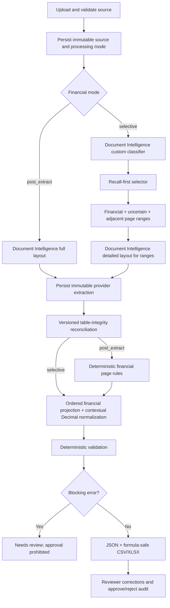
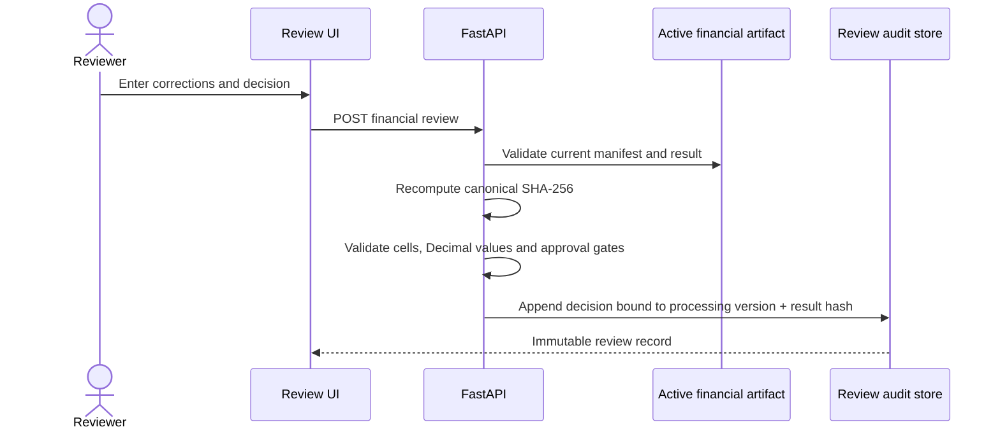
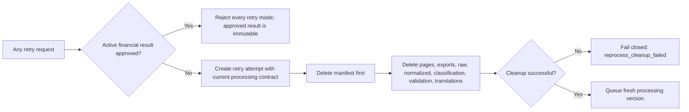

# Financial Extraction Engine

- **Document type:** Product and implementation specification
- **Financial schemas:** `financial-classification-1.1`, `table-reconciliation-1.0`, `financial-result-1.4`, `financial-validation-1.3`
- **Last reviewed:** 2026-08-09

## 1. Objective

Extract financial data from documents up to the configured page ceiling (300 pages by default) without flattening it or presenting unrelated document content as financial. Financial tables remain tables; headings, narrative disclosures, key-values, and list items retain their semantic format and source order. The engine preserves original page numbers, geometry, raw OCR text, translations, table coordinates, normalized values, classification evidence, validation findings, and reviewer history.

The current implementation is not authorization for real sensitive records — see [DATA-SECURITY.md](./DATA-SECURITY.md) for the approval gates. It runs against Azure Document Intelligence and Azure OpenAI, with Azure Database for PostgreSQL and Azure Blob Storage as the target metadata/artifact stores (§12 lists what's not yet deployed).

## 2. Processing modes

| Mode | Current status | Detailed extraction | Cost effect | Intended use |
|---|---|---|---|---|
| `off` | Implemented | Existing document pipeline only | No financial increment | Disable financial artifacts |
| `post_extract` | Implemented; local default | Full document layout, then deterministic financial selection | Does not reduce Document Intelligence page cost | Baseline evaluation and classifier comparison |
| `selective` | Partially implemented; configuration-dependent | Custom classifier first, then selected/uncertain/adjacent page ranges | Can reduce detailed-layout pages; classifier still receives the source | Controlled experiment after classifier and corpus approval |

The extraction mode is stored by the backend when the document is created. The client cannot downgrade it during retry.

## 3. End-to-end flow

## 4. Recall-first page selection

For every source page the classification artifact stores all provider candidates plus the chosen label, confidence, disposition, decision reasons, selection flag, review flag, classifier ID/version, and selection-policy fingerprint.

Selection rules:

1. Any approved financial label at or above the include threshold selects the page.
2. A competing higher-confidence non-financial label cannot suppress qualifying financial evidence; the conflict is flagged for review.
3. Financial evidence below the include threshold is uncertain and selected.
4. A page with insufficient evidence is uncertain and selected.
5. Only a page with no financial candidate and non-financial evidence at or above the exclusion threshold is excluded.
6. Configured adjacent pages are included as uncertain.
7. Classification must contain exactly one decision for every original source page.

Cached classification is accepted only when the classifier ID, declared classifier version, selection-policy fingerprint, schema, and complete page coverage remain valid. Invalid or incompatible cache data fails closed and requires controlled reprocessing.

## 5. Format-preserving financial projection

`financial-result-1.4` contains an ordered `content_items` stream in addition to normalized tables and validation:

- `heading`, `paragraph`, `key_value`, `list_item`, and `table` are explicit semantic types; key-value items carry source and translated key/value subfields when translation preserves the pair.
- Financial signal-bearing text is retained. Unrelated narrative text is excluded.
- The nearest preceding source heading is retained only as context for a financial signal or provider table.
- Table items reference the normalized table by stable `table_id`; cells are never flattened into prose.
- Source/translated text, source language, page list, geometry, relevance, warnings, and review state remain attached to each item.
- Items are sorted deterministically by source page, provider span, semantic priority, and stable ID.
- Table cells carry source and translated text. Any non-English, non-linguistic content is translation-eligible - including a script the local heuristic can't identify, which is routed to the translation model rather than blocked. A cell remains review-required only if the model itself can't identify the language it translated, or the resolved language falls outside the currently benchmarked set (Arabic, Chinese, English).
- The UI renders the ordered stream as a financial document with Source and English views. Normalized values are shown separately and never replace the source value.
- The frontend can still read stored `financial-result-1.1` table-only artifacts; normalized
  values from a pre-1.4 result are withheld because they lack semantic typing, and the UI asks
  for controlled reprocessing. Controlled reprocessing emits 1.4.

Recall-first behavior is preserved: uncertain page/table candidates remain visible and explicitly review-required rather than being silently discarded.

### 5.1 Table integrity and bounded reconstruction policy

The immutable `normalized/extracted.json` remains the provider result. The engine derives a
separate effective layout and a `table-reconciliation-1.0` evidence artifact:

- `provider_table_atomic_v1` retains every provider-returned cell once any source page of that
  table intersects the selected set. Boundary crossings and missing provider pages remain
  reviewable or blocking exactly as before.
- `aligned-orphan-columns-1.0` considers source blocks only when every provider row has the same
  number of vertically aligned blocks immediately to the left or right of a single-page table,
  column starts are stable, and the bounded width/column thresholds pass.
- The candidate stores the policy fingerprint, confidence, evidence codes, consumed source block
  IDs, provider/effective dimensions, page, and prepend/append action.
- Reconstructed cells keep their geometry, source language, source-block IDs, and a deterministic
  candidate ID. They are removed from the derived standalone block stream only, preventing UI
  duplication while leaving provider extraction untouched.
- The effective table uses `provider_table_with_reconciliation_v1`, is visibly distinguished in
  the UI, and remains review-required. Financial approval requires an append-only accepted
  structure decision bound to the active result hash.
- Incomplete row coverage, unstable alignment, multi-page tables, or excessive side columns are
  not reconstructed. Continuation-table merging remains a corpus-gated experiment decision.

## 6. Numeric normalization

Financial values use `Decimal`, never binary floating point.

- A deterministic semantic pass classifies each cell from its source value, row labels, and
  column headers before normalization. Monetary amounts, percentages, percentage ranges,
  quantities, measurements, phone numbers, dates/times, account numbers, identifiers, text,
  and unknown numeric values remain distinct.
- Only `monetary_amount` values enter monetary normalization or the correction gate. Supporting
  measurements such as `7.1 mg/L`, percentage ranges such as `95%-100%`, phone numbers, dates,
  account numbers, and identifiers preserve their source text and use `not_applicable` status.
- Dual separators are interpreted by the rightmost decimal separator only when grouping is structurally valid: `1.234,56` and `1,234.56` both become `1234.56`.
- Single-separator values such as `1.234` or `12,34` remain unnormalized unless strong table-level evidence establishes the decimal convention.
- Ambiguous monetary values have `normalized_value = null`, `normalization_status = ambiguous`,
  `requires_normalized_correction = true`, and `review_required = true`.
- Malformed parentheses, malformed percentages, and multiple currency symbols remain ambiguous.
- The `?` glyph carries candidates `CNY` and `JPY`. An explicit ISO/RMB code or page-level
  renminbi/yuan/yen evidence may resolve it; without that evidence the numeric amount may parse,
  but currency remains null and review-required.
- Parenthesized values are negative only when both parentheses are present.
- Raw OCR text remains immutable and separate from normalization and reviewer corrections.

## 7. Spreadsheet safety

Every string written to CSV or XLSX is checked after leading whitespace removal. Values beginning with ASCII or full-width `=`, `+`, `-`, or `@` are prefixed with an apostrophe. The rule applies to raw source text, normalized negative numbers, identifiers, currencies, validation messages, and manifest text.

CSV rows expose cell origin, source block IDs, reconciliation candidate, table-integrity state,
and currency ambiguity fields. XLSX cell comments preserve the same source/reconstruction
provenance without replacing the displayed source or normalized value.

Spreadsheet exports are machine results. Reviewer corrections are stored as an append-only overlay and are not silently substituted into the machine export.

## 8. Review and approval

Approval rules:

- The active financial result must belong to a completed or needs-review processing attempt.
- The manifest must declare the active artifact.
- Corrections may reference only active-result monetary cells explicitly marked with a required
  normalized or currency correction; corrections for measurements, phone numbers, account
  numbers, dates, identifiers, quantities, or percentage ranges are rejected.
- Every monetary cell with `requires_normalized_correction` needs a finite Decimal correction
  before approval.
- Every monetary cell with `requires_currency_correction` needs an explicit reviewer-selected
  ISO currency before approval.
- Every active reconstructed table candidate must have an `accepted` structure decision before
  approval; rejected or undecided structure keeps the result unapproved.
- Results with validation errors cannot be approved.
- The repository rechecks the active processing version and result SHA-256 inside the transaction.
- Financial approval updates only the financial review summary. It must not clear an independent OCR or translation review requirement.
- Rejection sets the document to `needs_review`.
- History remains append-only and identifies whether each decision belongs to the active result.

## 9. Reprocessing safety

The source upload and append-only review history are preserved. All derived counters and current-result review summary fields are reset. Readers require the current manifest before serving derived artifacts, preventing stale files from being treated as active.

## 10. Artifacts and API

| Artifact | Purpose |
|---|---|
| `classification/pages.json` | Complete page decisions and evidence |
| `normalized/extracted.json` | Immutable canonical extraction |
| `normalized/financial.json` | Machine financial projection |
| `validation/financial.json` | Deterministic findings |
| `pages/index.json` | Financial/review/all server-side page filtering |
| `exports/financial-document.json` | Versioned JSON export |
| `exports/financial-document.csv` | Flat provenance export |
| `exports/financial-document.xlsx` | Table workbook plus validation sheet |
| `manifest.json` | Current-attempt completion and artifact allowlist |

API families:

- `GET /documents/{id}/classification`
- `GET /documents/{id}/financial-result`
- `GET /documents/{id}/financial-validation`
- `GET /documents/{id}/financial-reviews`
- `POST /documents/{id}/financial-reviews`
- `GET /documents/{id}/pages?view=financial|review|all`
- `GET /documents/{id}/downloads/financial|financial-csv|financial-xlsx`

Derived downloads are available only for `completed` and `needs_review` documents with a current manifest declaration.

## 11. Experiment gate before P2

Use only synthetic or explicitly approved de-identified documents. The labeled corpus must include 100–200-page PDFs, scans, mixed bundles, statements, notes, continuation tables, ambiguous number formats, currencies, multilingual labels, blank pages, and near-financial non-financial tables.

Measure separately by document family:

- Financial page recall and false-exclusion rate.
- Table and cell coverage.
- Exact raw numeric preservation.
- Normalization accuracy and ambiguity rate.
- Review workload.
- Detailed-layout pages, classifier pages, latency, and Azure cost.
- Empty-selection and reprocessing correctness.

Selective mode cannot become the default until the accountable owner approves thresholds and demonstrates that no supported document family falls below the recall gate.

## 12. Deferred platform work

The following are not implemented by this increment: an Azure Blob Storage artifact-storage
adapter (SQLAlchemy's async engine is already portable to Azure Database for PostgreSQL via
connection string, but this hasn't been operationally validated against a deployed Postgres
instance), Service Bus workers, Entra ID federation on top of the existing organization/role
authorization layer, Defender for Storage malware scanning, managed identities, private endpoints,
controlled egress, and provider-result deletion evidence. They remain the next platform phase after
the extraction experiment.
