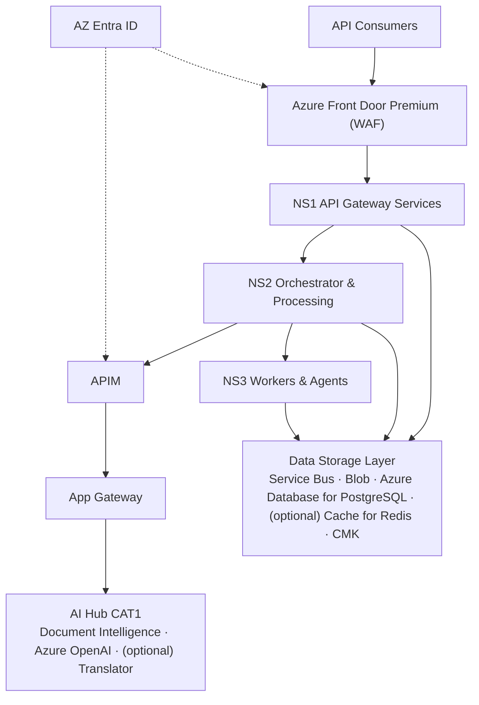

# CareTranslate Studio — Azure Backend Architecture

- **Offer:** Backend / API platform only (customers bring their own UI)
- **Style:** Enterprise solution architecture board
- **Scope:** Every component on this board is a Microsoft Azure service (or a service running
  on Azure infrastructure). No non-Azure infrastructure is part of this architecture.
- **Visual:** [multilingual-translator-studio-backend-architecture.png](./multilingual-translator-studio-backend-architecture.png)

> **SA - CareTranslate Studio (Azure Backend)** — production target architecture, not the current
> implementation state (see [../ARCHITECTURE.md](../ARCHITECTURE.md) for what's implemented today
> vs. what's shown here). Cream = new application components · Gray = existing / shared platform.

---

## 1. Board layout (how to read it)

| Zone | Contents |
|---|---|
| **Ingress** | API consumers → Azure Front Door Premium (WAF) |
| **Backend Environment (CAT 3)** | NS1 API services · NS2 Orchestrator & processing · NS3 Workers & agents |
| **AI Hub (CAT 1)** | Reached via APIM + App Gateway — Document Intelligence, Azure OpenAI, (optional) Translator |
| **Data Storage Layer** | Service Bus · Blob · PostgreSQL · Cache for Redis (optional) · **CMK encryption** |
| **Identity** | Entra ID · Enterprise IDP / identity governance |
| **Platform row** | Key Vault · Entra · Monitor · Log Analytics · CI/CD (GitHub Actions) · Artifact repo |

---

## 2. Namespaces (new application components)

### NS1 — API Gateway Services
- FastAPI `/api/v1`
- Upload, job status, pages, cancel/retry, artifact download
- JWT validation at the edge of the service

### NS2 — Orchestrator & Processing
- Central orchestrator (intake → extract → gateway → translate → export)
- Data Security Gateway + profile/rule library
- Profiles implemented today: `GENAI_PSEUDONYMIZED` · `GENAI_SYNTHETIC_POC` · `GENAI_RAW_EXCEPTION` · `MANAGED_NO_LLM` · `BLOCKED`
- Profiles proposed (not yet implemented as enum members): `RESTRICTED_LOCAL` · `HUMAN_ONLY`
- Inter-service JWT

### NS3 — Workers & Agents
- Page-range Document Intelligence worker
- Translation batch worker
- Retention / cleanup worker
- Prompt library + pseudonymization token service

---

## 3. AI Hub (CAT 1) — via APIM

| Service | Role |
|---|---|
| **Azure Document Intelligence 4.0** | Layout / OCR / languages / polygons |
| **Azure OpenAI** | Structured translation (approved minimized blocks) |
| **Azure AI Translator** | Non-LLM translation route |

Backend never exposes AI keys to consumers; all AI calls stay server-side through APIM + private networking.

---

## 4. Data Storage Layer

| Store | Use |
|---|---|
| **Service Bus** | Durable jobs, locks, DLQ, retries |
| **Blob Storage** | Quarantine, source, pages, exports, manifest |
| **Azure Database for PostgreSQL** | Documents, jobs, leases, financial/translation reviews, audit metadata |
| **Azure Cache for Redis** | Optional — coordinates the rate limiter's counters across multiple Container Apps replicas; a single-replica deployment doesn't need it |
| **CMK** | Server-side encryption with customer-managed keys |

This app has no semantic search/retrieval feature, so Azure AI Search is intentionally not part of
this architecture.

---

## 5. Sellable API surface (no UI included)

| Capability | Endpoint family |
|---|---|
| Intake | `POST /documents` |
| Lifecycle | status · cancel · retry (`resume` / `retranslate` / `reprocess`) |
| Assignment | reviewer assignment |
| Results | pages · page JSON · financial results · bilingual export · downloads |
| Review | financial-reviews and translation-reviews (append-only correction/approval history) |
| Auth | Bearer token today; target is Entra ID + APIM product subscriptions |

Customers integrate their own front-end, mobile app, or BFF.

---

## 6. Mermaid (same topology)



---

## 7. Files

| File | Purpose |
|---|---|
| [Multilingual-Translation-Studio-Backend-Architecture.pptx](./Multilingual-Translation-Studio-Backend-Architecture.pptx) | **Editable PowerPoint** — Slide 1 polished board image · Slide 2 Azure-icon map · Slide 3 notes |
| [Multilingual-Translation-Studio-Backend-Architecture.drawio](./Multilingual-Translation-Studio-Backend-Architecture.drawio) | **Editable draw.io** (open in [diagrams.net](https://app.diagrams.net)) |
| [multilingual-translator-studio-backend-architecture.png](./multilingual-translator-studio-backend-architecture.png) | Static PNG board |
| `icons/png/*.png` | Official Azure architecture icons used in the PPT |

Regenerate:

```powershell
node scripts\convert_azure_icons.js
backend\.venv\Scripts\python.exe scripts\generate_backend_architecture_pptx.py
```
